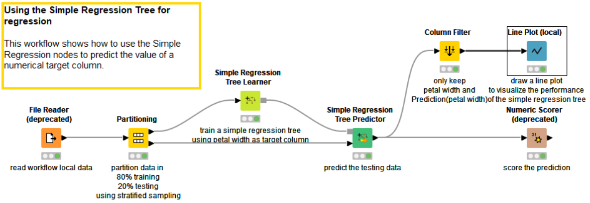
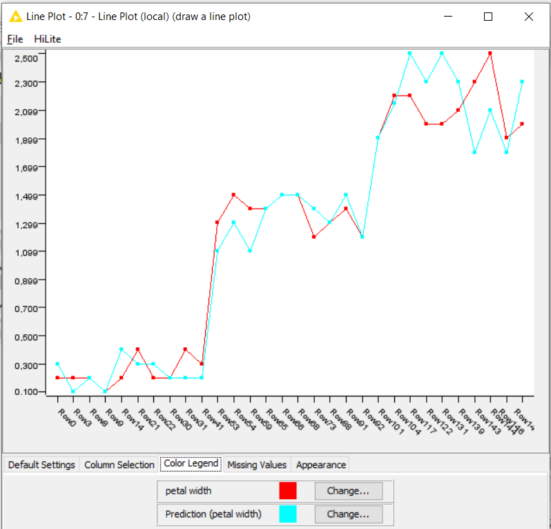
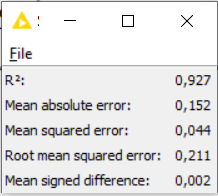

El workflow muestra una regresión simple para predecir un valor numérico de la variable objetivo. El conjunto de datos se divide en dos partes, el 80% para el training y el restante para el testing. Se entrena el modelo con el training y luego se le aplica este al testing. Finalmente se ve el resultado obtenido.

## Operador “File Reader”

Al hacer doble clic sobre el operador me muestra los datos que tiene la tabla Iris. Este operador tiene muchas más opciones para la importación de datos que RapidMiner. Para seleccionar la variable para predecir se hace en el operador Simple Regression Tree Model. Para el caso del modelo predicará el ancho del pétalo.

## Operador “Partitioning”

Este operador permite particionar el conjunto de datos. KNIME solo se puede hacerlo en 2 conjuntos a diferencia de Split Data de RapidMiner que puede hacerlo en más particiones. KNIME tiene la opción de persistir estos datos en el disco duro además de la caché de la memoria.

## Operador “Simple Regression Tree Learner”

Soporta variables de predicción numérica. El procedimiento sigue el algoritmo descrito por "Árboles de clasificación y regresión" (Breiman et al, 1984). Aquí el valor predicho para un nodo hoja es el valor objetivo medio de los registros dentro de la hoja. Los parámetros que permite configurar son:

## La variable a predecir (Target Column)

Permite seleccionar qué columnas se podrán usar para la predicción.
Incorpora 2 algoritmos para el tratamiento de los valores perdidos.
Al igual que en RapidMiner se le puede configurar la profundidad y el tamaño mínimo del nodo.

## Operador “Simple Regresión Tree Predictor”

Este operador tiene dos entradas, los datos que sirvieron para el entrenamiento en en operador “Simple Regression Tree Learner” y el conjunto de datos sobre el que se testeara el modelo. La salida de este operador es la predicción realizada.

## Operador “Line Plot”

Aquí se puede ver el resultado obtenido de la predicción comparado con los valores verdaderos.

## Operador “Numeric Scorer”

Este operador brinda información detallada de las estadísticas obtenidas del modelo. Un MSE muy cercano a cero quiere decir que el modelo funciona muy bien.