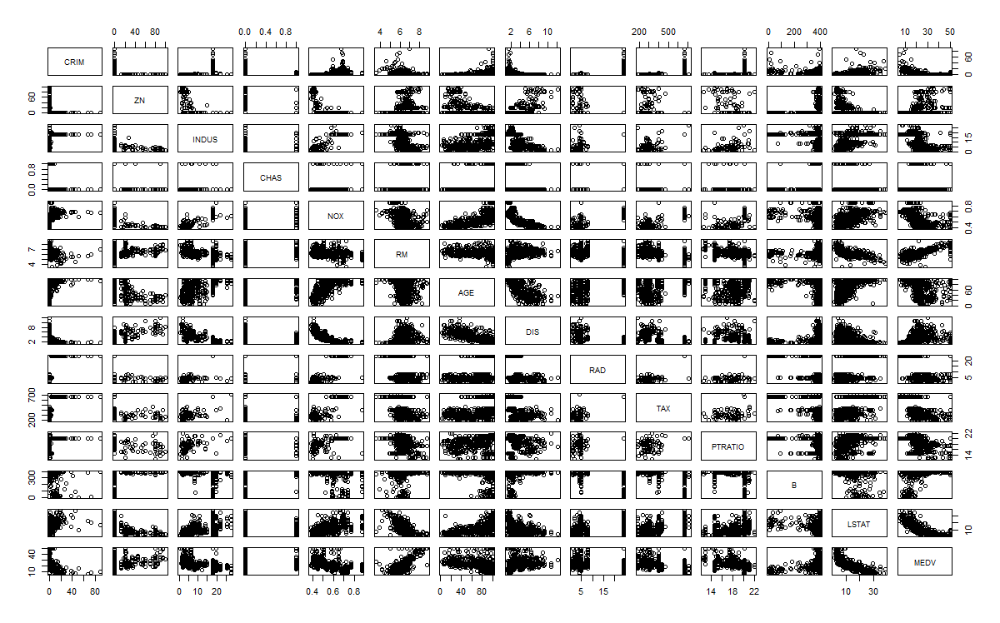
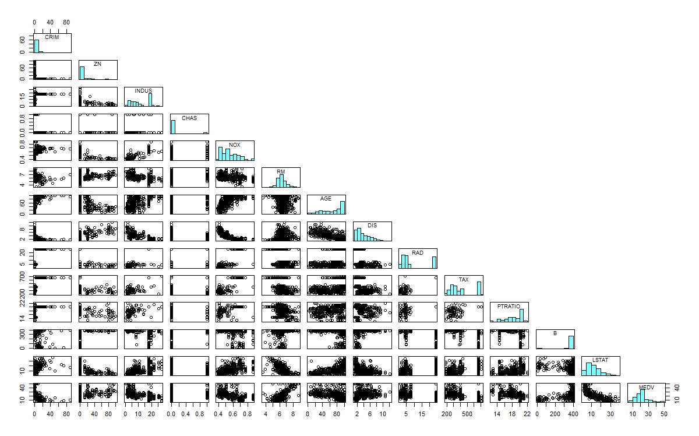
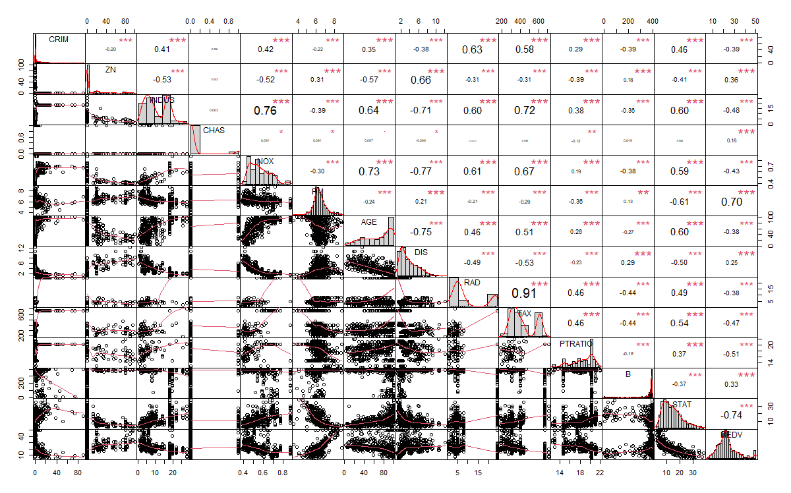

En esta entrada aprenderemos a realizar gráficos simples para tener un primer acercamiento sobre los atributos y sus relaciones de las bases de datos que vallamos a trabajar.

Para esto utilizaremos RStudio.

## Opción 1

```
#Cargamos los datos
#Reemplaza por tu directorio donde se encuentre el archivo a cargar
housing <- read.csv("C:/Users/ferna/Desktop/IA/portafolio/housing/housing.csv", sep=";")
pairs(housing)
```

Si ejecutamos el código anterior, obtenemos el siguiente resultado:



Es un gráfico muy cargado, donde vemos información repetida. En los siguiente pasos optimizaremos este gráfico para hacer mas rica la información que desprende.

La diagonal, se podría aprovechar para que además del atributo muestre un histograma correspondiente a es variable.

```
# Función para agregar histogramas
panel.hist <- function(x, ...) {
  usr <- par("usr")
  on.exit(par(usr))
  par(usr = c(usr[1:2], 0, 1.5))
  his <- hist(x, plot = FALSE)
  breaks <- his$breaks
  nB <- length(breaks)
  y <- his$counts
  y <- y/max(y)
  rect(breaks[-nB], 0, breaks[-1], y, col = rgb(0, 1, 1, alpha = 0.5), ...)
  # lines(density(x), col = 2, lwd = 2) # Descomenta para añadir curvas de densidad
}

#Realizamos el gráfico
pairs(housing,
      upper.panel = NULL,         # Deshabilitamos el panel superior
      diag.panel = panel.hist)    # Añadimos los histogramas
```

Gráfico obtenido:



Aquí estamos dejando el cuadrante arriba a la derecha en blanco solamente con fines estéticos, ya que si no lo especificamos mostrara los mismos datos que el cuadrante inferior a la izquierda.

Pero podríamos aprovechar el cuadrante libre para mostrar otra información relevante que complemente la de los gráficos. Para eso agregamos el siguiente código antes de la llamada a pairs(...).

```
#Función para agregar coeficientes de correlación
panel.cor <- function(x, y, digits = 2, prefix = "", cex.cor, ...) {
  usr <- par("usr")
  on.exit(par(usr))
  par(usr = c(0, 1, 0, 1))
  Cor <- abs(cor(x, y)) # Elimina la función abs si lo prefieres
  txt <- paste0(prefix, format(c(Cor, 0.123456789), digits = digits)[1])
  if(missing(cex.cor)) {
    cex.cor <- 0.4 / strwidth(txt)
  }
  text(0.5, 0.5, txt,
       cex = 1 + cex.cor * Cor) # Escala el texto al nivel de correlación
}

#Realizamos el gráfico
#Presta atención que actualizamos el parámetro upper.panel = panel.cor
pairs(housing,
      upper.panel = panel.cor,         # Deshabilitamos el panel superior
      diag.panel = panel.hist)    # Añadimos los histogramas
```

Resultado obtenido:


Ahora la información proporcionada es mas completa, ya que los gráficos a veces no se pueden entender mucho si hay muchos atributos en el juego de datos. Tenemos a simple vista las correlación que hay entre todos los elementos del dataset.

## Opción 2

```
#No requiere tantas lineas de código
#Instalamos la librería "PerformanceAnalytics"
install.packages("PerformanceAnalytics")

#Intanciamos la librería
library(PerformanceAnalytics)

#Realizamos el gráfico
chart.Correlation(housing, histogram = TRUE, method = "pearson")
```

Resultado obtenido:



Este trabajo fue basado en: <https://r-coder.com/grafico-correlacion-r/>