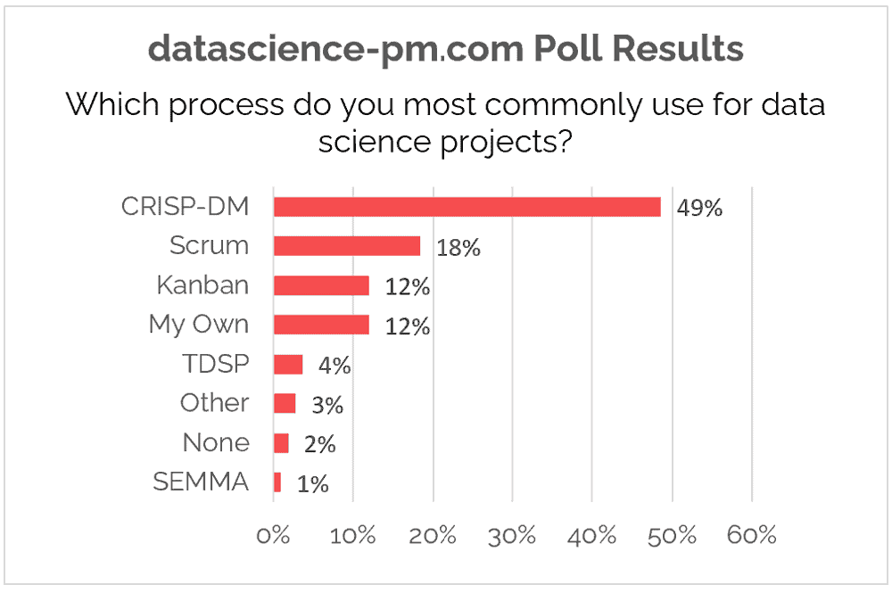

A continuación veremos tres modelos utilizados para la minería y análisis de datos.

## CRISP-DM

CRISP-DM (del inglés Cross Industry Standard Process for Data Mining) se trata de un modelo estándar abierto del proceso que describe los enfoques comunes que utilizan los expertos en minería de datos. Es el modelo analítico más usado.

Este proceso establece 6 fases para el proceso de modelado de datos, las que no necesariamente deben realizarse en ese orden, sino que en los proyectos es frecuente avanzar y retroceder entre ellas si es necesario:

* Comprensión del negocio: hay que comprender los objetivos del negocio lo que permite elaborar un plan preliminar.
* Comprensión de los datos: comienza con la colección de datos inicial para ir familiarizándose con ellos y ya detectar posibles patrones o anomalías.
* Preparación de los datos: esta etapa incluye desde la selección de los atributos, transformaciones, completar información faltante y limpieza de la información. 
* Fase de modelado: aquí se selecciona la técnica de modelado a aplicar. 
* Evaluación: aquí se evalúan los modelos construidos para comprobar si cumplen efectivamente con los objetivos del negocio.
* Implantación: consiste desde la generación de un informe a la repetición del proceso de minería a lo largo de toda la organización.

## Otras metodologías usadas son KDD y SEMMA.

En la metodología **KDD** (Knowledge Discovery in Databases) se encuentran las etapas:

* Selección
* Preprocesamiento
* Transformación
* Minería de datos
* Evaluación e implantación.

KDD es el proceso general de descubrimiento de conocimiento en datos a través de la minería de datos o la extracción de patrones e información de grandes conjuntos de datos utilizando aprendizaje automático, estadísticas y sistemas de bases de datos. Este es un proceso iterativo e interactivo.

**SEMMA** es el acrónimo de las cinco fases que la componen: 

* SampleExplore
* Modify
* Model
* Assess

Aunque está diseñado para ayudar a guiar a los usuarios a través de herramientas en SAS Enterprise Miner para problemas de minería de datos, SEMMA a menudo se considera una metodología general de minería de datos.

## Conclusión

Estas metodologías en cuanto a las etapas que las componen son bastantes similares a CRISP-DM, aunque esta última gana en popularidad. Así lo demuestra una encuesta realizada por Data Science Process Alliance en la imagen inferior, además las búsquedas de CRISP-DM en google son muy superiores comparadas a las otras metodologías.

