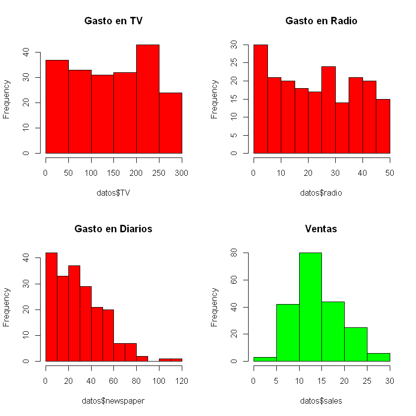
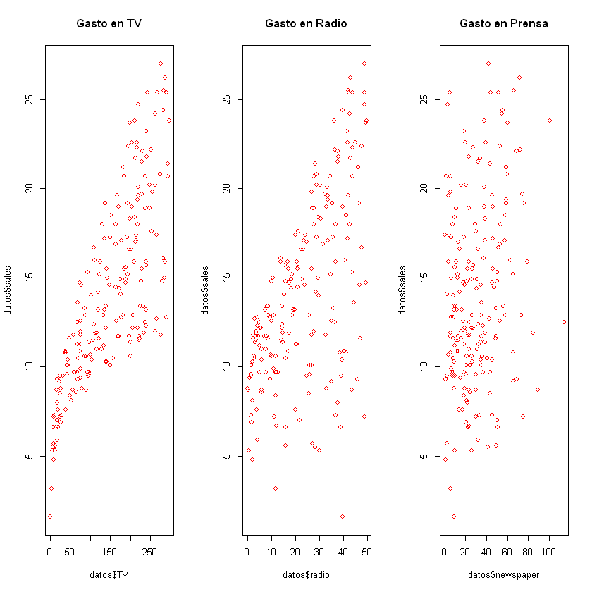
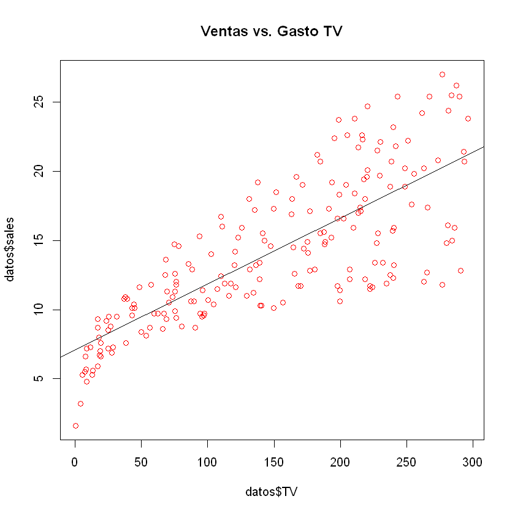
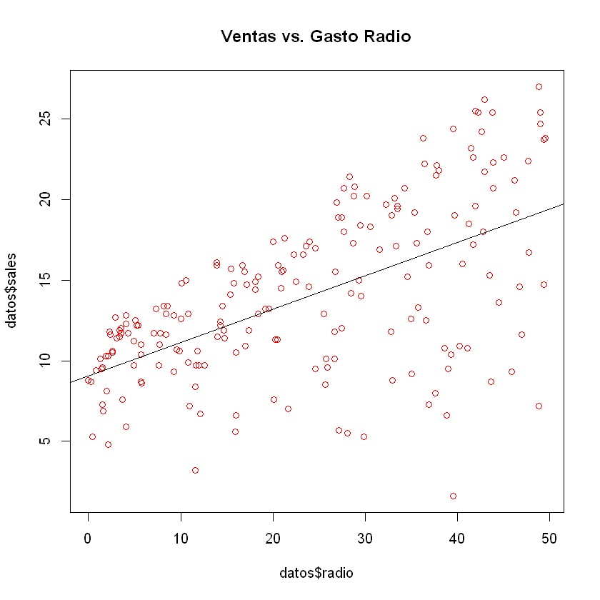
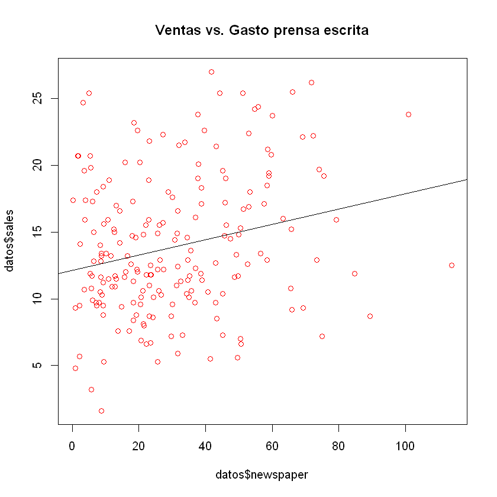

En esta primera parte se realizara una regresión lineal simple (con rStudio) para el conjunto de datos de Advertising. La idea de ellos es ver cual de las otras variables explica mejor las ventas.

## Cargamos las librerías necesarias

```R
library(rio)
```

```R
# establecemos el directorio de trabajo
setwd('C:/Users/ferna/Desktop/adn1')
getwd()
```

'C:/Users/ferna/Desktop/adn1'

## Entendimiento del negocio / problema

La base de datos Advertising.csv contiene las ventas de un producto en 200 mercados diferentes junto con con la inversión publicitara para tres medios diferentes: TV, radio y prensa escrita.

Se intentará estimar la relación entre el gasto publicitario en los tres medios y las ventas. Primero en forma univariada (considerando un medio por vez) y luego la relación conjunta de los tres medios.

## Obtención de datos y Análisis Exploratorio (EDA)

```R
# importamos los datos y vemos cantidad de filas y columnas
datos <- import('Advertising.csv')
dim(datos)
```

<ol class=list-inline>
	<li>200</li>
	<li>5</li>
</ol>

```R
# nombres de las variables
names(datos)
```

<ol class=list-inline>
	<li>'V1'</li>
	<li>'TV'</li>
	<li>'radio'</li>
	<li>'newspaper'</li>
	<li>'sales'</li>
</ol>

```R
# vemos algunos datos de ejemplo
head(datos)
# notar que la variable V1 es un id autonumérico de 1 a 200
```

<table>
<thead><tr><th scope=col>V1</th><th scope=col>TV</th><th scope=col>radio</th><th scope=col>newspaper</th><th scope=col>sales</th></tr></thead>
<tbody>
	<tr><td>1    </td><td>230.1</td><td>37.8 </td><td>69.2 </td><td>22.1 </td></tr>
	<tr><td>2    </td><td> 44.5</td><td>39.3 </td><td>45.1 </td><td>10.4 </td></tr>
	<tr><td>3    </td><td> 17.2</td><td>45.9 </td><td>69.3 </td><td> 9.3 </td></tr>
	<tr><td>4    </td><td>151.5</td><td>41.3 </td><td>58.5 </td><td>18.5 </td></tr>
	<tr><td>5    </td><td>180.8</td><td>10.8 </td><td>58.4 </td><td>12.9 </td></tr>
	<tr><td>6    </td><td>  8.7</td><td>48.9 </td><td>75.0 </td><td> 7.2 </td></tr>
</tbody>
</table>

```R
# resumen de los datos
summary(datos)
```

```
       V1               TV             radio          newspaper     
 Min.   :  1.00   Min.   :  0.70   Min.   : 0.000   Min.   :  0.30  
 1st Qu.: 50.75   1st Qu.: 74.38   1st Qu.: 9.975   1st Qu.: 12.75  
 Median :100.50   Median :149.75   Median :22.900   Median : 25.75  
 Mean   :100.50   Mean   :147.04   Mean   :23.264   Mean   : 30.55  
 3rd Qu.:150.25   3rd Qu.:218.82   3rd Qu.:36.525   3rd Qu.: 45.10  
 Max.   :200.00   Max.   :296.40   Max.   :49.600   Max.   :114.00  
     sales      
 Min.   : 1.60  
 1st Qu.:10.38  
 Median :12.90  
 Mean   :14.02  
 3rd Qu.:17.40  
 Max.   :27.00  
```

El resumen anterior tiene al menos dos objetivos:

* Observar si existen datos erróneos o extraños que deban contemplarse o eliminarse. Por ejemplo, si existieran datos negativos o extremadamente altos o bajos.
* Nos ayudan a establecer el rango de datos sobre los que podremos extrapolar nuestra función en futuras predicciones. Si encontramos un medio que gasta por ejemplo, 500 unidades monetarias en TV cuando en nuestro dataset el máximo de la inversión en TV es 296.40 eso nos podrá alertar al menos y eventualmente desechar, cualquier extrapolación o uso de nuestra fórmula usando un caso de ese tipo.

A continuación se presenta un resumen gráfico de los datos que analizaremos. Primero observamos histogramas de las variables y luego digramas de dispersión entre las ventas y los diferentes gastos en publicidad. Recordar que es muy importante visualizar los datos. NO SE PUEDE ESTIMAR NINGUN MODELO SI NO ENTENDEMOS LOS DATOS QUE TENEMOS.

```R
# gráficos de las variables univariados
# notar el uso del comando 'par(mfrow = c(2, 2))'' que crea una 'grilla' de 2x2 para incrustar los gáficos
par(mfrow = c(2, 2))
hist(datos$TV, col = 'red', main = 'Gasto en TV')
hist(datos$radio, col = 'red', main = 'Gasto en Radio')
hist(datos$newspaper, col = 'red', main = 'Gasto en Diarios')
hist(datos$sales, col = 'green', main = 'Ventas')
```



```R
# gráficos bivariados: se crean los diagramas de dispersión que relacionan las ventas vs. el gasto en c/medio
par(mfrow = c(1, 3))
plot(datos$TV, datos$sales, , col = 'red', main = 'Gasto en TV')
plot(datos$radio, datos$sales, col = 'red', main = 'Gasto en Radio')
plot(datos$newspaper, datos$sales, col = 'red', main = 'Gasto en Prensa')
```



Notar que a través de los gráficos anteriores ya podemos visualizar la fortaleza de la relación de los gastos publicitarios con las ventas. Parecería que el gasto en TV tiene una relación más fuerte que el gasto en Prensa escrita (newspaper). Esta es una hipótesis que deberemos confirmar en nuestro análisis posterior de regresión.

A continuación analizamos la relación (medida por el coeficiente de correlación) entre las diferentes variables independientes del modelo o regresores (las Xs) y la variable dependiente o variable respuesta (la Y).

Con este análisis tratamos de entender al menos dos aspectos:

1. Tener una estimación objetiva inicial de la relación de cada x con la y.
2. Estimar la relación de cada una de las Xs con las restantes Xs. Porqué este último aspecto? Porque si tenemos variables que son muy similares entre sí, estaremos sobre-dimensionando la importancia de ese aspecto (básicamente estamos poniendo dos variables similares) y por último, nos puede generar un problema de MULTICOLINEALIDAD: https://es.wikipedia.org/wiki/Multicolinealidad

```R
# calculamos la correlación entre las Xs del modelo y también con la variable Y
cor(datos[, -1])  # notar que excluimos la variable autonumérica V1
```

<table>
<thead><tr><th></th><th scope=col>TV</th><th scope=col>radio</th><th scope=col>newspaper</th><th scope=col>sales</th></tr></thead>
<tbody>
	<tr><th scope=row>TV</th><td>1.00000000</td><td>0.05480866</td><td>0.05664787</td><td>0.7822244 </td></tr>
	<tr><th scope=row>radio</th><td>0.05480866</td><td>1.00000000</td><td>0.35410375</td><td>0.5762226 </td></tr>
	<tr><th scope=row>newspaper</th><td>0.05664787</td><td>0.35410375</td><td>1.00000000</td><td>0.2282990 </td></tr>
	<tr><th scope=row>sales</th><td>0.78222442</td><td>0.57622257</td><td>0.22829903</td><td>1.0000000 </td></tr>
</tbody>
</table>

A partir de la matriz anterior se confirma que el gasto en TV es la variable con mayor relación con las ventas (coeficiente de correlación de 0.78) y que el gasto en prensa escrita tiene el menor impacto (coef. de correlación de 0.22).

A continuación partimos el dataset en training (entrenamiento) y testing (validación) para estimar los coeficientes del modelo en el primero y tener una estimación independiente de la performance en el dataset de validación.

En este caso se ha decidido tomar una muestra de entrenamiento del 70% y por ende se deja para testing el 30%.

## Estimación

```R
# partimos el dataset en training y testing
# desarrollamos en training y validamos performance del modelo en testing
set.seed(1111)   # se fija una semilla para que los resultados aleatorios sean reproducibles
train <- sample(nrow(datos), nrow(datos)*0.7) # elegimos el 70% de números aleatoreamente (140)
```

```R
# generación de la base de testing
test <- (-train)
```

```R
# primera regresión de ventas contra gasto en TV en training
# sales = b0 + b1*TV + error
reg.tv <- lm(sales ~ TV, datos[train, ])  # Los resultados se guardan en el elemento reg.tv
summary(reg.tv) # visualizamos los resultados de la regresión
```

```
Call:
lm(formula = sales ~ TV, data = datos[train, ])

Residuals:
   Min     1Q Median     3Q    Max 
-8.114 -1.686 -0.291  2.196  7.154 

Coefficients:
            Estimate Std. Error t value Pr(>|t|)    
(Intercept) 7.081894   0.553031   12.81   <2e-16 ***
TV          0.047582   0.003322   14.32   <2e-16 ***
---
Signif. codes:  0 '***' 0.001 '**' 0.01 '*' 0.05 '.' 0.1 ' ' 1

Residual standard error: 3.3 on 138 degrees of freedom
Multiple R-squared:  0.5979,	Adjusted R-squared:  0.595 
F-statistic: 205.2 on 1 and 138 DF,  p-value: < 2.2e-16
```

La ecuación estimada es: sales = 7.08 + 0.047*TV

```R
# intervalo para el 95% de confianza para los parámetros de la regresión
confint(reg.tv, level = 0.95)
```

<table>
<thead><tr><th></th><th scope=col>2.5 %</th><th scope=col>97.5 %</th></tr></thead>
<tbody>
	<tr><th scope=row>(Intercept)</th><td>5.98838420</td><td>8.17540405</td></tr>
	<tr><th scope=row>TV</th><td>0.04101336</td><td>0.05415012</td></tr>
</tbody>
</table>

Ahora que tenemos la 'fórmula' que relaciona el gasto en TV con las ventas, podemos predecir las ventas que estima nuestro modelo sobre el dataset que hemos utilizado.

```R
# hacemos una predicción 'manual'
# notar que estamos haciendo la predicción sobre el total del dataset y no solo en training o testing
datos$pred_sales <- 7.081894 + 0.047582*datos$TV
# vemos que ahora aparece la columna 'pred_sales' que son nuestras ventas predichas
head(datos)
```

<table>
<thead><tr><th scope=col>V1</th><th scope=col>TV</th><th scope=col>radio</th><th scope=col>newspaper</th><th scope=col>sales</th><th scope=col>pred_sales</th></tr></thead>
<tbody>
	<tr><td>1        </td><td>230.1    </td><td>37.8     </td><td>69.2     </td><td>22.1     </td><td>18.030512</td></tr>
	<tr><td>2        </td><td> 44.5    </td><td>39.3     </td><td>45.1     </td><td>10.4     </td><td> 9.199293</td></tr>
	<tr><td>3        </td><td> 17.2    </td><td>45.9     </td><td>69.3     </td><td> 9.3     </td><td> 7.900304</td></tr>
	<tr><td>4        </td><td>151.5    </td><td>41.3     </td><td>58.5     </td><td>18.5     </td><td>14.290567</td></tr>
	<tr><td>5        </td><td>180.8    </td><td>10.8     </td><td>58.4     </td><td>12.9     </td><td>15.684720</td></tr>
	<tr><td>6        </td><td>  8.7    </td><td>48.9     </td><td>75.0     </td><td> 7.2     </td><td> 7.495857</td></tr>
</tbody>
</table>

```R
# también podemos realizar la predicción de las ventas usando un comando sin necesidad de 'escribir' la fórmula
datos$pred_sales_2 <- predict(reg.tv, datos)
# ahora aparece la columna 'pred_sales_2' que es igual a la columna 'pred_sales' dado que usan la misma fórmula
head(datos)
```

<table>
<thead><tr><th scope=col>V1</th><th scope=col>TV</th><th scope=col>radio</th><th scope=col>newspaper</th><th scope=col>sales</th><th scope=col>pred_sales</th><th scope=col>pred_sales_2</th></tr></thead>
<tbody>
	<tr><td>1        </td><td>230.1    </td><td>37.8     </td><td>69.2     </td><td>22.1     </td><td>18.030512</td><td>18.030452</td></tr>
	<tr><td>2        </td><td> 44.5    </td><td>39.3     </td><td>45.1     </td><td>10.4     </td><td> 9.199293</td><td> 9.199281</td></tr>
	<tr><td>3        </td><td> 17.2    </td><td>45.9     </td><td>69.3     </td><td> 9.3     </td><td> 7.900304</td><td> 7.900300</td></tr>
	<tr><td>4        </td><td>151.5    </td><td>41.3     </td><td>58.5     </td><td>18.5     </td><td>14.290567</td><td>14.290527</td></tr>
	<tr><td>5        </td><td>180.8    </td><td>10.8     </td><td>58.4     </td><td>12.9     </td><td>15.684720</td><td>15.684672</td></tr>
	<tr><td>6        </td><td>  8.7    </td><td>48.9     </td><td>75.0     </td><td> 7.2     </td><td> 7.495857</td><td> 7.495855</td></tr>
</tbody>
</table>

```R
# calculamos el error que comentemos al usar nuestro modelo
datos$error <- datos$sales - datos$pred_sales_2
summary(datos$error[train])  # ojo que el resumen estadístico de los errores lo hacemos en training
```

```
   Min. 1st Qu.  Median    Mean 3rd Qu.    Max. 
 -8.114  -1.686  -0.291   0.000   2.196   7.154 
```

```R
# aparece ahora la columna de error
head(datos)
```

<table>
<thead><tr><th scope=col>V1</th><th scope=col>TV</th><th scope=col>radio</th><th scope=col>newspaper</th><th scope=col>sales</th><th scope=col>pred_sales</th><th scope=col>pred_sales_2</th><th scope=col>error</th></tr></thead>
<tbody>
	<tr><td>1         </td><td>230.1     </td><td>37.8      </td><td>69.2      </td><td>22.1      </td><td>18.030512 </td><td>18.030452 </td><td> 4.0695479</td></tr>
	<tr><td>2         </td><td> 44.5     </td><td>39.3      </td><td>45.1      </td><td>10.4      </td><td> 9.199293 </td><td> 9.199281 </td><td> 1.2007185</td></tr>
	<tr><td>3         </td><td> 17.2     </td><td>45.9      </td><td>69.3      </td><td> 9.3      </td><td> 7.900304 </td><td> 7.900300 </td><td> 1.3997000</td></tr>
	<tr><td>4         </td><td>151.5     </td><td>41.3      </td><td>58.5      </td><td>18.5      </td><td>14.290567 </td><td>14.290527 </td><td> 4.2094725</td></tr>
	<tr><td>5         </td><td>180.8     </td><td>10.8      </td><td>58.4      </td><td>12.9      </td><td>15.684720 </td><td>15.684672 </td><td>-2.7846724</td></tr>
	<tr><td>6         </td><td>  8.7     </td><td>48.9      </td><td>75.0      </td><td> 7.2      </td><td> 7.495857 </td><td> 7.495855 </td><td>-0.2958553</td></tr>
</tbody>
</table>

```R
# calculamos el error cuadrático
datos$error_cuad <-datos$error**2
head(datos)
```

<table>
<thead><tr><th scope=col>V1</th><th scope=col>TV</th><th scope=col>radio</th><th scope=col>newspaper</th><th scope=col>sales</th><th scope=col>pred_sales</th><th scope=col>pred_sales_2</th><th scope=col>error</th><th scope=col>error_cuad</th></tr></thead>
<tbody>
	<tr><td>1          </td><td>230.1      </td><td>37.8       </td><td>69.2       </td><td>22.1       </td><td>18.030512  </td><td>18.030452  </td><td> 4.0695479 </td><td>16.56122013</td></tr>
	<tr><td>2          </td><td> 44.5      </td><td>39.3       </td><td>45.1       </td><td>10.4       </td><td> 9.199293  </td><td> 9.199281  </td><td> 1.2007185 </td><td> 1.44172496</td></tr>
	<tr><td>3          </td><td> 17.2      </td><td>45.9       </td><td>69.3       </td><td> 9.3       </td><td> 7.900304  </td><td> 7.900300  </td><td> 1.3997000 </td><td> 1.95916001</td></tr>
	<tr><td>4          </td><td>151.5      </td><td>41.3       </td><td>58.5       </td><td>18.5       </td><td>14.290567  </td><td>14.290527  </td><td> 4.2094725 </td><td>17.71965896</td></tr>
	<tr><td>5          </td><td>180.8      </td><td>10.8       </td><td>58.4       </td><td>12.9       </td><td>15.684720  </td><td>15.684672  </td><td>-2.7846724 </td><td> 7.75440039</td></tr>
	<tr><td>6          </td><td>  8.7      </td><td>48.9       </td><td>75.0       </td><td> 7.2       </td><td> 7.495857  </td><td> 7.495855  </td><td>-0.2958553 </td><td> 0.08753033</td></tr>
</tbody>
</table>

Hacemos el diagnóstico del modelo calculando el ECM (Error Cuadrático Medio) y el R-cuadrado

```R
# calculamos el ECM en training
summary(datos$error_cuad[train])
```

```
    Min.  1st Qu.   Median     Mean  3rd Qu.     Max. 
 0.00346  0.96700  4.00692 10.73527 16.54099 65.83546 
```

```R
# calculamos el ECM en training
mean(datos$error_cuad[train])
```

10.7352725462272

```R
# calculamos el ECM en testing
mean(datos$error_cuad[test])
```

10.00368474657

```R
# gráficamos nuevamente las ventas vs. gasto en TV y agregamos la recta de regresión estimada
plot(datos$TV, datos$sales, main = 'Ventas vs. Gasto TV', col = 'red')
abline(reg.tv)
```



Calculamos la otra medida de performance del modelo: R-cuadrado

```R
# calculo del R-cuadrado en training
corel <- cor(datos$sales[train], datos$pred_sales_2[train])
corel**2
```

0.597865465104672

```R
# calculo del R-cuadrado en testing
corel <- cor(datos$sales[test], datos$pred_sales_2[test])
corel**2
```

0.642914751013206

A continuación se estimarán las dos regresiones adicionales que relacionan las ventas con el gasto publicitario en Radio y Prensa escrita y sus respectivos ECMs y R-cuadrados

**Gasto en Radio**

```R
reg.radio <- lm(sales ~ radio, datos[train, ])
summary(reg.radio)
```

```
Call:
lm(formula = sales ~ radio, data = datos[train, ])

Residuals:
     Min       1Q   Median       3Q      Max 
-15.6508  -2.0264   0.8951   2.8239   7.8290 

Coefficients:
            Estimate Std. Error t value Pr(>|t|)    
(Intercept)  9.07445    0.66630  13.619  < 2e-16 ***
radio        0.20647    0.02402   8.597 1.59e-14 ***
---
Signif. codes:  0 '***' 0.001 '**' 0.01 '*' 0.05 '.' 0.1 ' ' 1

Residual standard error: 4.2 on 138 degrees of freedom
Multiple R-squared:  0.3488,	Adjusted R-squared:  0.344 
F-statistic: 73.91 on 1 and 138 DF,  p-value: 1.593e-14
```

```R
# sales = 9.07445 + 0.20647*radio
datos$sales_pred_radio <- predict(reg.radio, datos)
head(datos)
```

<table>
<thead><tr><th scope=col>V1</th><th scope=col>TV</th><th scope=col>radio</th><th scope=col>newspaper</th><th scope=col>sales</th><th scope=col>pred_sales</th><th scope=col>pred_sales_2</th><th scope=col>error</th><th scope=col>error_cuad</th><th scope=col>sales_pred_radio</th></tr></thead>
<tbody>
	<tr><td>1          </td><td>230.1      </td><td>37.8       </td><td>69.2       </td><td>22.1       </td><td>18.030512  </td><td>18.030452  </td><td> 4.0695479 </td><td>16.56122013</td><td>16.87913   </td></tr>
	<tr><td>2          </td><td> 44.5      </td><td>39.3       </td><td>45.1       </td><td>10.4       </td><td> 9.199293  </td><td> 9.199281  </td><td> 1.2007185 </td><td> 1.44172496</td><td>17.18884   </td></tr>
	<tr><td>3          </td><td> 17.2      </td><td>45.9       </td><td>69.3       </td><td> 9.3       </td><td> 7.900304  </td><td> 7.900300  </td><td> 1.3997000 </td><td> 1.95916001</td><td>18.55156   </td></tr>
	<tr><td>4          </td><td>151.5      </td><td>41.3       </td><td>58.5       </td><td>18.5       </td><td>14.290567  </td><td>14.290527  </td><td> 4.2094725 </td><td>17.71965896</td><td>17.60179   </td></tr>
	<tr><td>5          </td><td>180.8      </td><td>10.8       </td><td>58.4       </td><td>12.9       </td><td>15.684720  </td><td>15.684672  </td><td>-2.7846724 </td><td> 7.75440039</td><td>11.30436   </td></tr>
	<tr><td>6          </td><td>  8.7      </td><td>48.9       </td><td>75.0       </td><td> 7.2       </td><td> 7.495857  </td><td> 7.495855  </td><td>-0.2958553 </td><td> 0.08753033</td><td>19.17098   </td></tr>
</tbody>
</table>

```R
# gráficamos nuevamente las ventas vs. gasto en Radio y agregamos la recta de regresión estimada
plot(datos$radio, datos$sales, main = 'Ventas vs. Gasto Radio', col = 'red')
abline(reg.radio)
```



```R
# ECM en testing
mean((datos$sales[test] - datos$sales_pred_radio[test])**2)
```

19.8239284293495

```R
# R-cuadrado en testing
corel <- cor(datos$sales[test], datos$sales_pred_radio[test])
corel**2
```

0.29938955839583

**Gasto en Prensa escrita**

```R
reg.news <- lm(sales ~ newspaper, datos[train, ])
summary(reg.news)
```

```
Call:
lm(formula = sales ~ newspaper, data = datos[train, ])

Residuals:
     Min       1Q   Median       3Q      Max 
-11.0221  -3.3683  -0.7684   3.0887  12.4747 

Coefficients:
            Estimate Std. Error t value Pr(>|t|)    
(Intercept) 12.12181    0.75197  16.120  < 2e-16 ***
newspaper    0.05750    0.01977   2.908  0.00424 ** 
---
Signif. codes:  0 '***' 0.001 '**' 0.01 '*' 0.05 '.' 0.1 ' ' 1

Residual standard error: 5.052 on 138 degrees of freedom
Multiple R-squared:  0.05775,	Adjusted R-squared:  0.05093 
F-statistic: 8.459 on 1 and 138 DF,  p-value: 0.004236
```

```R
# sales = 12.12181 + 0.05750*newspaper
datos$sales_pred_news <- predict(reg.news, datos)
head(datos)
```

<table>
<thead><tr><th scope=col>V1</th><th scope=col>TV</th><th scope=col>radio</th><th scope=col>newspaper</th><th scope=col>sales</th><th scope=col>pred_sales</th><th scope=col>pred_sales_2</th><th scope=col>error</th><th scope=col>error_cuad</th><th scope=col>sales_pred_radio</th><th scope=col>sales_pred_news</th></tr></thead>
<tbody>
	<tr><td>1          </td><td>230.1      </td><td>37.8       </td><td>69.2       </td><td>22.1       </td><td>18.030512  </td><td>18.030452  </td><td> 4.0695479 </td><td>16.56122013</td><td>16.87913   </td><td>16.10083   </td></tr>
	<tr><td>2          </td><td> 44.5      </td><td>39.3       </td><td>45.1       </td><td>10.4       </td><td> 9.199293  </td><td> 9.199281  </td><td> 1.2007185 </td><td> 1.44172496</td><td>17.18884   </td><td>14.71507   </td></tr>
	<tr><td>3          </td><td> 17.2      </td><td>45.9       </td><td>69.3       </td><td> 9.3       </td><td> 7.900304  </td><td> 7.900300  </td><td> 1.3997000 </td><td> 1.95916001</td><td>18.55156   </td><td>16.10658   </td></tr>
	<tr><td>4          </td><td>151.5      </td><td>41.3       </td><td>58.5       </td><td>18.5       </td><td>14.290567  </td><td>14.290527  </td><td> 4.2094725 </td><td>17.71965896</td><td>17.60179   </td><td>15.48558   </td></tr>
	<tr><td>5          </td><td>180.8      </td><td>10.8       </td><td>58.4       </td><td>12.9       </td><td>15.684720  </td><td>15.684672  </td><td>-2.7846724 </td><td> 7.75440039</td><td>11.30436   </td><td>15.47983   </td></tr>
	<tr><td>6          </td><td>  8.7      </td><td>48.9       </td><td>75.0       </td><td> 7.2       </td><td> 7.495857  </td><td> 7.495855  </td><td>-0.2958553 </td><td> 0.08753033</td><td>19.17098   </td><td>16.43434   </td></tr>
</tbody>
</table>

```R
# gráficamos nuevamente las ventas vs. gasto en prensa escrita y agregamos la recta de regresión estimada
plot(datos$newspaper, datos$sales, main = 'Ventas vs. Gasto prensa escrita', col = 'red')
abline(reg.news)
```



```R
# ECM en testing
mean((datos$sales[test] - datos$sales_pred_news[test])**2)
```

26.9688971447639

```R
# R-cuadrado en testing
corel <- cor(datos$sales[test], datos$sales_pred_news[test])
corel**2
```

0.0431605481381341

Próximamente parte 2