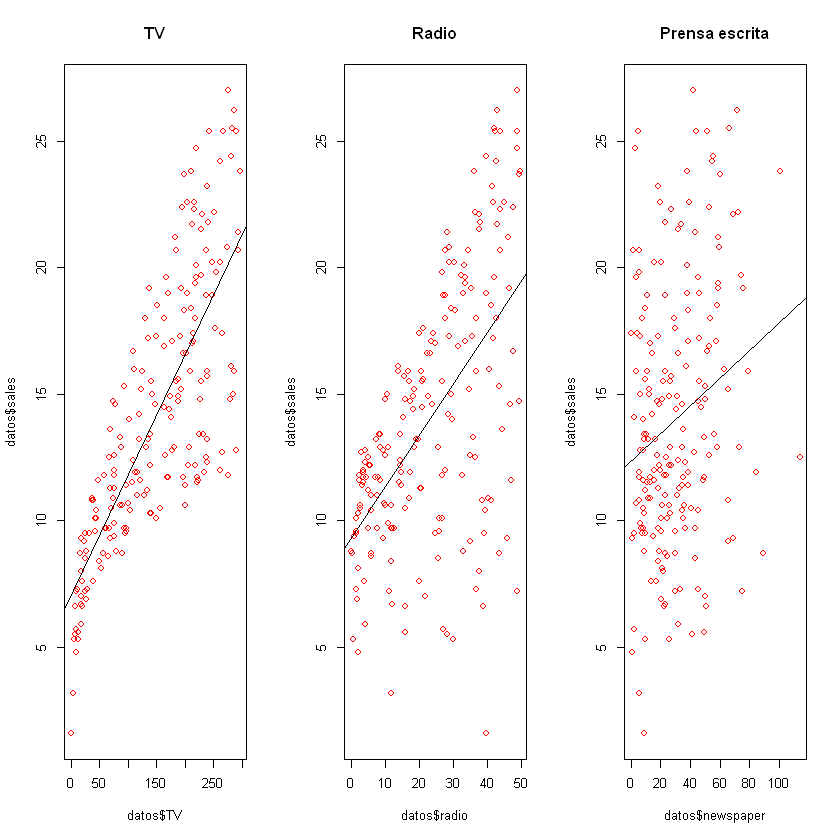

Una vez analizada la relación BIVARIADA entre ventas y cada uno de los gastos en los medios (buscar "Advertising (parte 1)"), nos interesa saber el impacto de cada gasto en medio considerando todos a la misma vez. Esto es, realizar un análisis MULTIVARIADO del problema.

```R
# cargamos las librerias necesararias
library(rio)
```

```R
# establecemos el directorio de trabajo
setwd('C:/Users/ferna/Desktop/adn1')
getwd()
```

'C:/Users/ferna/Desktop/adn1'

```R
# importamos los datos tal cual lo hicimos en la primer parte y vemos cantidad de filas y columnas
datos <- import('Advertising.csv')
dim(datos)
```

<ol class=list-inline>
	<li>200</li>
	<li>5</li>
</ol>

```R
# diagramamos la dispersión incluyendo las regresiones simples
par(mfrow = c(1, 3))
plot(datos$TV, datos$sales, col = 'red', main = 'TV')
abline(lm(sales ~ TV, datos))

plot(datos$radio, datos$sales, col = 'red', main = 'Radio')
abline(lm(sales ~ radio, datos))

plot(datos$newspaper, datos$sales, col = 'red', main = 'Prensa escrita')
abline(lm(sales ~ newspaper, datos))
```



```R
# partimos el dataset en training y testing
# desarrollamos en training y validamos performance del modelo en testing
set.seed(1111)   # se fija una semilla para que los resultados aleatorios sean reproducibles (usamos la misma que la de la primera parte)
train <- sample(nrow(datos), nrow(datos)*0.7) # elegimos el 70% de números aleatoreamente (140)
```

```R
# generación de la base de testing
test <- (-train)
```

```R
# realizamos una regresión múltiple para predecir las ventas en función de los tres gastos de publicidad
reg.todos <- lm(sales ~ TV + radio + newspaper, datos[train, ])
summary(reg.todos)
```

```
Call:
lm(formula = sales ~ TV + radio + newspaper, data = datos[train, 
    ])

Residuals:
    Min      1Q  Median      3Q     Max 
-8.7780 -0.8129  0.2114  1.0417  2.9363 

Coefficients:
            Estimate Std. Error t value Pr(>|t|)    
(Intercept) 2.767963   0.371418   7.452 9.62e-12 ***
TV          0.045685   0.001677  27.239  < 2e-16 ***
radio       0.190579   0.010047  18.969  < 2e-16 ***
newspaper   0.003579   0.006881   0.520    0.604    
---
Signif. codes:  0 '***' 0.001 '**' 0.01 '*' 0.05 '.' 0.1 ' ' 1

Residual standard error: 1.661 on 136 degrees of freedom
Multiple R-squared:  0.8995,	Adjusted R-squared:  0.8973 
F-statistic:   406 on 3 and 136 DF,  p-value: < 2.2e-16
```

```R
confint(reg.todos, level = 0.95)
```

<table>
<thead><tr><th></th><th scope=col>2.5 %</th><th scope=col>97.5 %</th></tr></thead>
<tbody>
	<tr><th scope=row>(Intercept)</th><td> 2.03346104</td><td>3.50246512 </td></tr>
	<tr><th scope=row>TV</th><td> 0.04236839</td><td>0.04900179 </td></tr>
	<tr><th scope=row>radio</th><td> 0.17071029</td><td>0.21044727 </td></tr>
	<tr><th scope=row>newspaper</th><td>-0.01002728</td><td>0.01718611 </td></tr>
</tbody>
</table>

Cuando analizamos la significancia estadística de cada una de las variables en el modelo vemos que la probabilidad de ser = 0 del coeficiente de la variable newspaper es 0.604! Dado que esta variable no es importante para el modelo procedemos a reestimar el mismo excluyendo la variable newspaper.

NOTA: si vemos la significancia estadística de las variables cuando se estimaron los modelos simples, todas eran significativas... por ende, cuando estimamos un modelo de regresión múltiple, los resultados de las regresiones simples pueden y regularmente van a cambiar...

Re-estimamos el modelo excluyendo la variable `newspaper`

```R
reg.sin.news <- lm(sales ~ TV + radio, datos[train, ])
summary(reg.sin.news)
```

```
Call:
lm(formula = sales ~ TV + radio, data = datos[train, ])

Residuals:
    Min      1Q  Median      3Q     Max 
-8.8795 -0.8709  0.2136  1.0685  2.9182 

Coefficients:
            Estimate Std. Error t value Pr(>|t|)    
(Intercept) 2.834227   0.347964   8.145  2.1e-13 ***
TV          0.045730   0.001670  27.375  < 2e-16 ***
radio       0.192255   0.009491  20.257  < 2e-16 ***
---
Signif. codes:  0 '***' 0.001 '**' 0.01 '*' 0.05 '.' 0.1 ' ' 1

Residual standard error: 1.657 on 137 degrees of freedom
Multiple R-squared:  0.8993,	Adjusted R-squared:  0.8979 
F-statistic: 612.1 on 2 and 137 DF,  p-value: < 2.2e-16
```

En este caso resultó sencillo analizar el modelo múltiple y decidir excluir la variable newspaper ya que estamos trabajando con pocas variables. Sin embargo, en un caso donde tuviéramos por ejemplo 200 o 500 o 1000 regresores, sería imposible realizar ese análisis caso a caso de qué variable excluir.

En ese caso se realiza una selección automática de las variables según tres posibles opciones:

* Se inicializa el modelo con todas las variables y se ELIMINAN las menos significativas hasta llegar el modelo final. Esta estrategia se denomina DE ELIMINACIÓN HACIA ATRÁS o BACKWARD ELIMINATION.
* Se inicializa el modelo solo con la constante y se AGREGAN las variables más significativas en forma secuencial. Esta estrategia se denomina de AGREGACIÓN HACIA ADELANTE O FORWARD AGGREGATION.
* El tercer método consiste en la combinación de los dos métodos anteriores partiendo con solo la constante en el modelo.En este caso resultó sencillo analizar el modelo múltiple y decidir excluir la variable newspaper. Sin embargo, en un caso donde tuviéramos por ejemplo 200 o 500 o 1000 regresores, sería imposible realizar ese análisis caso a caso de qué variable excluir.

Ya determinamos la variable que no deberiamos tener en cuenta, pero a modo ilustrativo se mostrara el procedimiento a aplicar en caso de que estemos trabajando con un dataset mucho mas complejo.

```R
# eliminación hacia atrás.
reg.todos <- lm(sales ~ TV + radio + newspaper, datos[train, ])

# reg.todos <- lm(sales ~ ., datos[train, ])  //Recordemos que esta linea es equivalente a la anterior

reg.fin.back <- step(reg.todos, direction = 'backward')
summary(reg.fin.back)
```

```
Start:  AIC=146.1
sales ~ TV + radio + newspaper

            Df Sum of Sq     RSS    AIC
- newspaper  1      0.75  376.18 144.38
<none>                    375.43 146.10
- radio      1    993.28 1368.71 325.20
- TV         1   2048.28 2423.72 405.20

Step:  AIC=144.38
sales ~ TV + radio

        Df Sum of Sq     RSS    AIC
<none>                376.18 144.38
- radio  1    1126.8 1502.94 336.29
- TV     1    2057.7 2433.92 403.79


Call:
lm(formula = sales ~ TV + radio, data = datos[train, ])

Residuals:
    Min      1Q  Median      3Q     Max 
-8.8795 -0.8709  0.2136  1.0685  2.9182 

Coefficients:
            Estimate Std. Error t value Pr(>|t|)    
(Intercept) 2.834227   0.347964   8.145  2.1e-13 ***
TV          0.045730   0.001670  27.375  < 2e-16 ***
radio       0.192255   0.009491  20.257  < 2e-16 ***
---
Signif. codes:  0 '***' 0.001 '**' 0.01 '*' 0.05 '.' 0.1 ' ' 1

Residual standard error: 1.657 on 137 degrees of freedom
Multiple R-squared:  0.8993,	Adjusted R-squared:  0.8979 
F-statistic: 612.1 on 2 and 137 DF,  p-value: < 2.2e-16
```

```R
# ahora probaremos los resultados con la combinación de criterios
reg.todos <- lm(sales ~ TV + radio + newspaper, datos[train, ])
reg.fin.both <- step(reg.todos, direction = 'both')
summary(reg.fin.both)
```

```
Start:  AIC=146.1
sales ~ TV + radio + newspaper

            Df Sum of Sq     RSS    AIC
- newspaper  1      0.75  376.18 144.38
<none>                    375.43 146.10
- radio      1    993.28 1368.71 325.20
- TV         1   2048.28 2423.72 405.20

Step:  AIC=144.38
sales ~ TV + radio

            Df Sum of Sq     RSS    AIC
<none>                    376.18 144.38
+ newspaper  1      0.75  375.43 146.10
- radio      1   1126.76 1502.94 336.29
- TV         1   2057.74 2433.92 403.79


Call:
lm(formula = sales ~ TV + radio, data = datos[train, ])

Residuals:
    Min      1Q  Median      3Q     Max 
-8.8795 -0.8709  0.2136  1.0685  2.9182 

Coefficients:
            Estimate Std. Error t value Pr(>|t|)    
(Intercept) 2.834227   0.347964   8.145  2.1e-13 ***
TV          0.045730   0.001670  27.375  < 2e-16 ***
radio       0.192255   0.009491  20.257  < 2e-16 ***
---
Signif. codes:  0 '***' 0.001 '**' 0.01 '*' 0.05 '.' 0.1 ' ' 1

Residual standard error: 1.657 on 137 degrees of freedom
Multiple R-squared:  0.8993,	Adjusted R-squared:  0.8979 
F-statistic: 612.1 on 2 and 137 DF,  p-value: < 2.2e-16
```

En este caso vemos que el modelo final elegido coincide en la eliminación de la variable newspaper. Decidimos entonces quedarnos con el modelo que excluye a esa variable y procedemos a calcular la bondad de ajuste del modelo (la calidad del modelo) en testing, usando las medidas conocidas de ECM y R-cuadrado.

```R
# guardamos los resultados de la predicción
datos$pred_sales <- predict(reg.todos, datos)
head(datos)
```

<table>
<thead><tr><th scope=col>V1</th><th scope=col>TV</th><th scope=col>radio</th><th scope=col>newspaper</th><th scope=col>sales</th><th scope=col>pred_sales</th></tr></thead>
<tbody>
	<tr><td>1       </td><td>230.1   </td><td>37.8    </td><td>69.2    </td><td>22.1    </td><td>20.73168</td></tr>
	<tr><td>2       </td><td> 44.5   </td><td>39.3    </td><td>45.1    </td><td>10.4    </td><td>12.45213</td></tr>
	<tr><td>3       </td><td> 17.2   </td><td>45.9    </td><td>69.3    </td><td> 9.3    </td><td>12.54937</td></tr>
	<tr><td>4       </td><td>151.5   </td><td>41.3    </td><td>58.5    </td><td>18.5    </td><td>17.76955</td></tr>
	<tr><td>5       </td><td>180.8   </td><td>10.8    </td><td>58.4    </td><td>12.9    </td><td>13.29512</td></tr>
	<tr><td>6       </td><td>  8.7   </td><td>48.9    </td><td>75.0    </td><td> 7.2    </td><td>12.75318</td></tr>
</tbody>
</table>

```R
# calculamos el error que cometemos al usar nuestro modelo
datos$error <- datos$sales - datos$pred_sales
summary(datos$error[train])  # ojo que el resumen estadístico de los errores lo hacemos en training
```

```
   Min. 1st Qu.  Median    Mean 3rd Qu.    Max. 
-8.7780 -0.8129  0.2114  0.0000  1.0417  2.9363 
```

```R
# aparece ahora la columna de error
head(datos)
```

<table>
<thead><tr><th scope=col>V1</th><th scope=col>TV</th><th scope=col>radio</th><th scope=col>newspaper</th><th scope=col>sales</th><th scope=col>pred_sales</th><th scope=col>error</th></tr></thead>
<tbody>
	<tr><td>1         </td><td>230.1     </td><td>37.8      </td><td>69.2      </td><td>22.1      </td><td>20.73168  </td><td> 1.3683240</td></tr>
	<tr><td>2         </td><td> 44.5     </td><td>39.3      </td><td>45.1      </td><td>10.4      </td><td>12.45213  </td><td>-2.0521273</td></tr>
	<tr><td>3         </td><td> 17.2     </td><td>45.9      </td><td>69.3      </td><td> 9.3      </td><td>12.54937  </td><td>-3.2493662</td></tr>
	<tr><td>4         </td><td>151.5     </td><td>41.3      </td><td>58.5      </td><td>18.5      </td><td>17.76955  </td><td> 0.7304462</td></tr>
	<tr><td>5         </td><td>180.8     </td><td>10.8      </td><td>58.4      </td><td>12.9      </td><td>13.29512  </td><td>-0.3951162</td></tr>
	<tr><td>6         </td><td>  8.7     </td><td>48.9      </td><td>75.0      </td><td> 7.2      </td><td>12.75318  </td><td>-5.5531819</td></tr>
</tbody>
</table>

```R
# calculamos el error cuadrático
datos$error_cuad <-datos$error**2
head(datos)
```

<table>
<thead><tr><th scope=col>V1</th><th scope=col>TV</th><th scope=col>radio</th><th scope=col>newspaper</th><th scope=col>sales</th><th scope=col>pred_sales</th><th scope=col>error</th><th scope=col>error_cuad</th></tr></thead>
<tbody>
	<tr><td>1         </td><td>230.1     </td><td>37.8      </td><td>69.2      </td><td>22.1      </td><td>20.73168  </td><td> 1.3683240</td><td> 1.8723107</td></tr>
	<tr><td>2         </td><td> 44.5     </td><td>39.3      </td><td>45.1      </td><td>10.4      </td><td>12.45213  </td><td>-2.0521273</td><td> 4.2112267</td></tr>
	<tr><td>3         </td><td> 17.2     </td><td>45.9      </td><td>69.3      </td><td> 9.3      </td><td>12.54937  </td><td>-3.2493662</td><td>10.5583806</td></tr>
	<tr><td>4         </td><td>151.5     </td><td>41.3      </td><td>58.5      </td><td>18.5      </td><td>17.76955  </td><td> 0.7304462</td><td> 0.5335517</td></tr>
	<tr><td>5         </td><td>180.8     </td><td>10.8      </td><td>58.4      </td><td>12.9      </td><td>13.29512  </td><td>-0.3951162</td><td> 0.1561168</td></tr>
	<tr><td>6         </td><td>  8.7     </td><td>48.9      </td><td>75.0      </td><td> 7.2      </td><td>12.75318  </td><td>-5.5531819</td><td>30.8378294</td></tr>
</tbody>
</table>

Hacemos el diagnóstico del modelo calculando el ECM (Error Cuadrático Medio) y el R-cuadrado

```R
# calculamos el ECM en training
summary(datos$error_cuad[train])
```

```
    Min.  1st Qu.   Median     Mean  3rd Qu.     Max. 
 0.00003  0.13728  0.98623  2.68166  2.84937 77.05334 
```

```R
# calculamos el ECM en training
mean(datos$error_cuad[train])
```

2.6816607924575

```R
# calculamos el ECM en testing
mean(datos$error_cuad[test])
```

3.06694299392365

```R
# R-cuadrado en testing
corel <- cor(datos$sales[test], datos$pred_sales[test])
corel**2
```

0.890730172561095

Como se aprecia en los resultados obtenidos, esta modelo es mucho mejor que el de la regresión simple realizado en la parte 1.