En este ejercicio haremos una clasificación de vinos, ya es hora de  que salgamos un poco de las predicciones. Utilizaremos el dataset Wine de [UCI](https://archive.ics.uci.edu/ml/datasets/wine).

Según el autor de este dataset, estos datos son el resultado de un análisis químico de vinos cultivados en la misma región en Italia pero derivados de tres cultivares diferentes. El análisis determinó las cantidades de 13 componentes que se encuentran en cada uno de los tres tipos de vinos. 

Este dataset es apropiado para iniciarse con los algoritmos de clasificación ya que al estar bien estructurado no es muy desafiante. 

## Atributos

Excepto el atributo Clase (variable objetivo que indica el tipo de vino), los restantes 13 atributos son de tipo contínuo y refieren a atributos de cada vino:

* Clase
* Alcohol
* Malic acid
* Ash
* Alcalinity of ash
* Magnesium
* Total phenols
* Flavanoids
* Nonflavanoid phenols
* Proanthocyanins
* Color intensity
* Hue
* OD280/OD315 of diluted wines
* Proline

## Análisis exploratorio

No se identifico ningún valor faltante para el juego de datos. Se identifican 178 observaciones las que 59 corresponden al tipo de vino 1, 71 al tipo de vino 2 y 48 al tipo de vino 3 de acuerdo a la siguiente imagen:

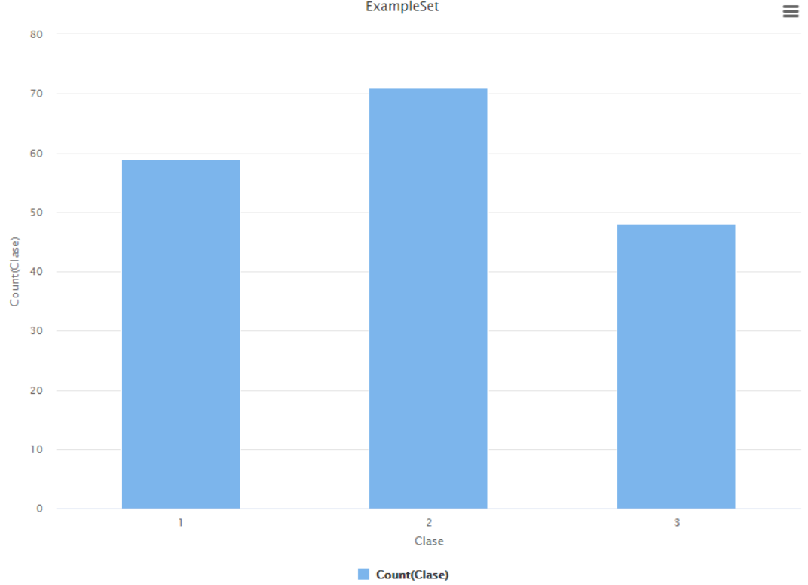

Un poco mas de información de cada atributo (esta información se obtuvo a través de RStudio):

```
> summary(x)
     Clase          Alcohol        Malic.acid         Ash        Alcalinity.of.ash   Magnesium     
 Min.   :1.000   Min.   :11.03   Min.   :0.740   Min.   :1.360   Min.   :10.60     Min.   : 70.00  
 1st Qu.:1.000   1st Qu.:12.36   1st Qu.:1.603   1st Qu.:2.210   1st Qu.:17.20     1st Qu.: 88.00  
 Median :2.000   Median :13.05   Median :1.865   Median :2.360   Median :19.50     Median : 98.00  
 Mean   :1.938   Mean   :13.00   Mean   :2.336   Mean   :2.367   Mean   :19.49     Mean   : 99.74  
 3rd Qu.:3.000   3rd Qu.:13.68   3rd Qu.:3.083   3rd Qu.:2.558   3rd Qu.:21.50     3rd Qu.:107.00  
 Max.   :3.000   Max.   :14.83   Max.   :5.800   Max.   :3.230   Max.   :30.00     Max.   :162.00  
 Total.phenols     Flavanoids    Nonflavanoid.phenols Proanthocyanins Color.intensity       Hue        
 Min.   :0.980   Min.   :0.340   Min.   :0.1300       Min.   :0.410   Min.   : 1.280   Min.   :0.4800  
 1st Qu.:1.742   1st Qu.:1.205   1st Qu.:0.2700       1st Qu.:1.250   1st Qu.: 3.220   1st Qu.:0.7825  
 Median :2.355   Median :2.135   Median :0.3400       Median :1.555   Median : 4.690   Median :0.9650  
 Mean   :2.295   Mean   :2.029   Mean   :0.3619       Mean   :1.591   Mean   : 5.058   Mean   :0.9574  
 3rd Qu.:2.800   3rd Qu.:2.875   3rd Qu.:0.4375       3rd Qu.:1.950   3rd Qu.: 6.200   3rd Qu.:1.1200  
 Max.   :3.880   Max.   :5.080   Max.   :0.6600       Max.   :3.580   Max.   :13.000   Max.   :1.7100  
 OD280.OD315.of.diluted.wines    Proline      
 Min.   :1.270                Min.   : 278.0  
 1st Qu.:1.938                1st Qu.: 500.5  
 Median :2.780                Median : 673.5  
 Mean   :2.612                Mean   : 746.9  
 3rd Qu.:3.170                3rd Qu.: 985.0  
 Max.   :4.000                Max.   :1680.0  
```

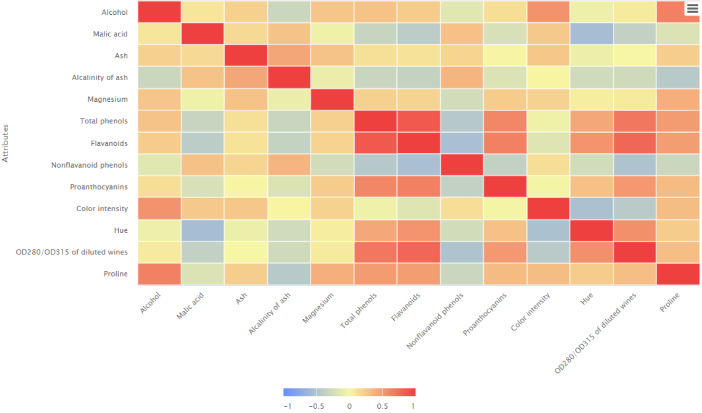

La matriz de correlación nos indica que hay atributos que están altamente correlacionados, a modo de ejemplo *Flavanoids* vs *Total phenois*. No se identifica una correlación indirecta en este juego de datos.

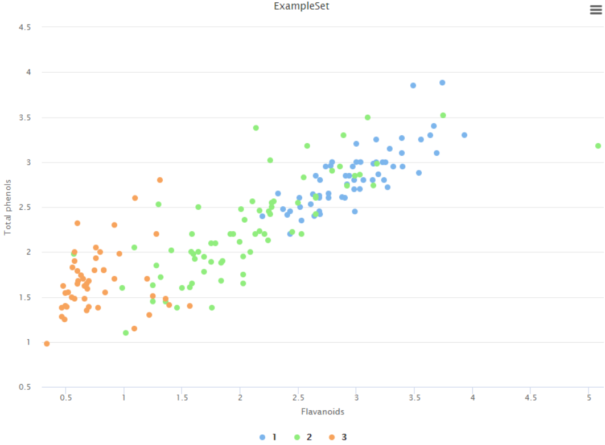

En la imagen superior se puede apreciar mas claramente las relación lineal que hay entre estos atributos.

## Creando el modelo de clasificación

### Parte 1

Usando RapidMiner crearemos un proceso como el de la siguiente imagen para tener una línea base con la cual comparar las siguientes mejoras que le iremos haciendo para que este sea mas performante.

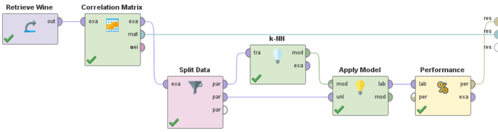

Aquí en el operador Split Data, particionamos nuestros datos, 70% de los mismos serán utilizados para entrenar el modelo y el otro 30% para testearlo. En el parámetro *sampling type* selecciona stratified sampling (esto nos permite que la distribución de los datos sea homogénea en ambas particiones).

El opreador k-NN no dejamos con los parametros por defecto. Ten en cuenta que aun no hemos normalizado los datos ni eliminados los atributos correlacionados.

Hasta este momento esta es la performance que obtiene este modelo:

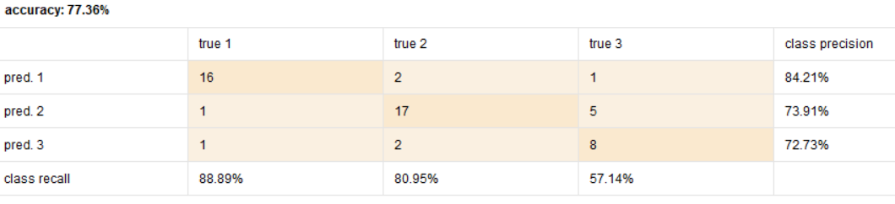

Como se puede apreciar, este modelo tiene mucho para mejorar aun.

### Parte 2

Para la parte 2 normalizamos los datos con el operador *Normalize* con el método z-transformation. También dejamos afuera los atributos que tengan una correlación superior a 0.72. El proceso hasta el momento debería estar de acuerdo a la siguiente imagen:

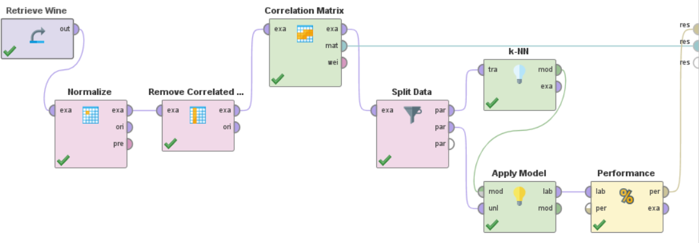

Performance obtenida en la parte 2:

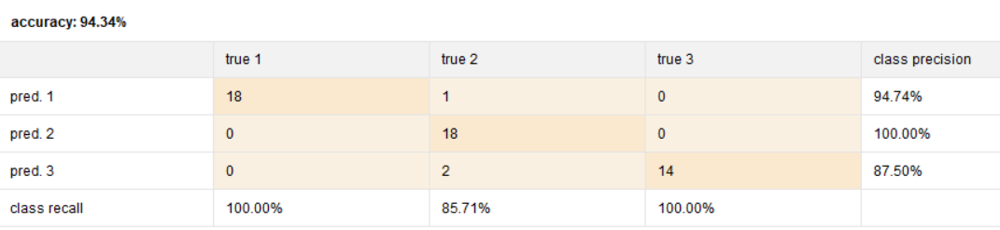

Como se aprecia en la imagen anterior nuestro modelo es mucho mas performante que en la parte 1. Pero aquí únicamente estamos utilizando un único conjunto de entrenamiento para entrenar el mismo y un único conjunto de datos como caso de pruebas. ¿Qué pasaría si utilizamos todos nuestros datos para el entrenamiento y todos para el testeo?

### Parte 3

Para responder la pregunta anterior haremos uso de operador *Cross Validation*.

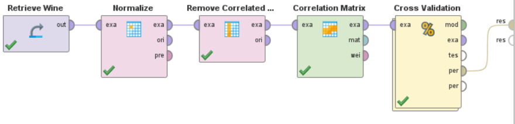

Y dentro del operador *Cross Validation* incluimos el operador *k-NN*, *Apply Model* y *Performance* como la siguiente imagen:

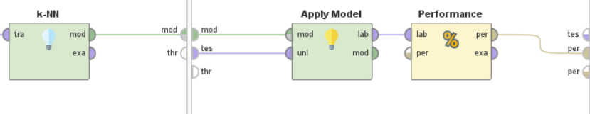

Ahora obtenemos la siguiente performance:

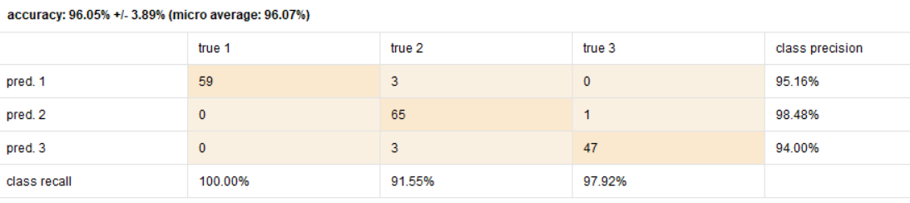

Como se aprecia en la imagen, se tuvo una performance un poco mejor a la parte 2. Pero si cambiamos el nuestro operador *k-NN* por *Naive Bayes*, obtenemos un mejor resultado:

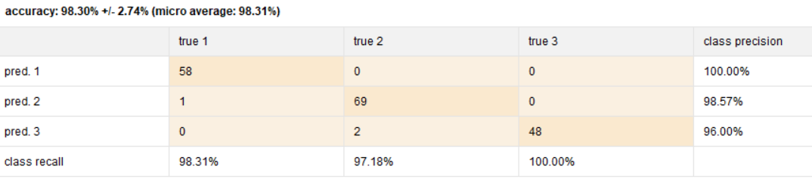