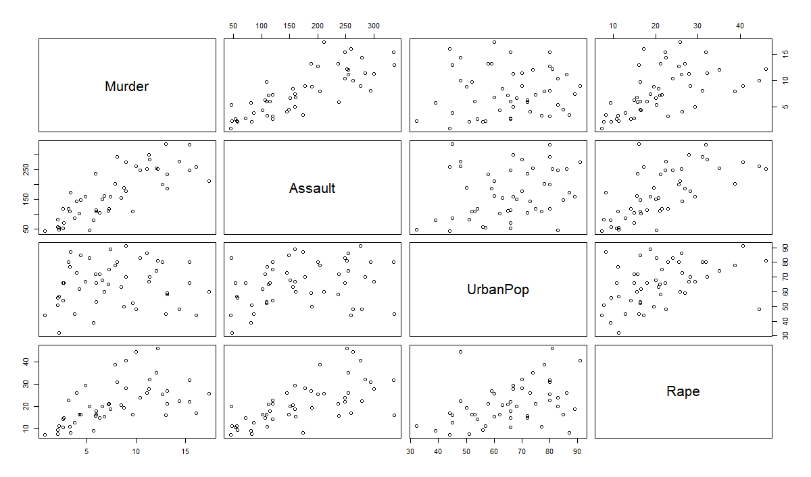
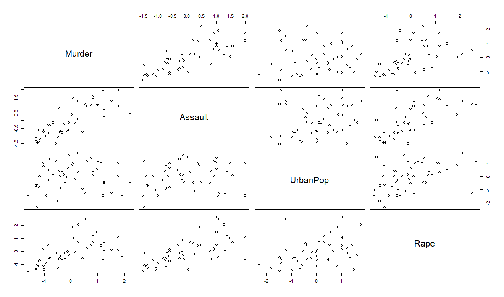
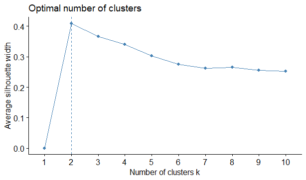
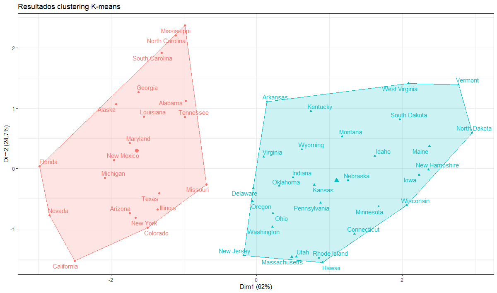
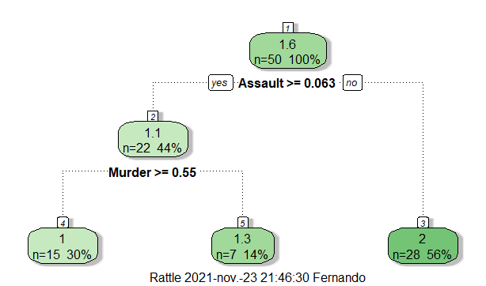
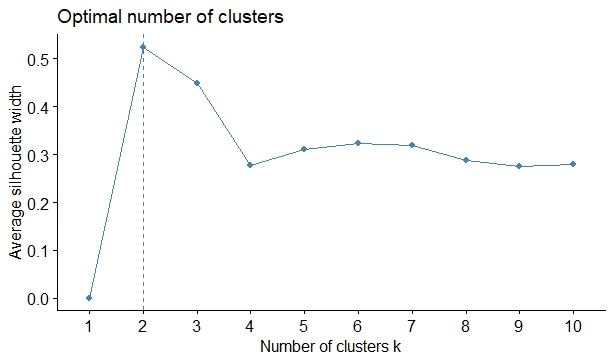
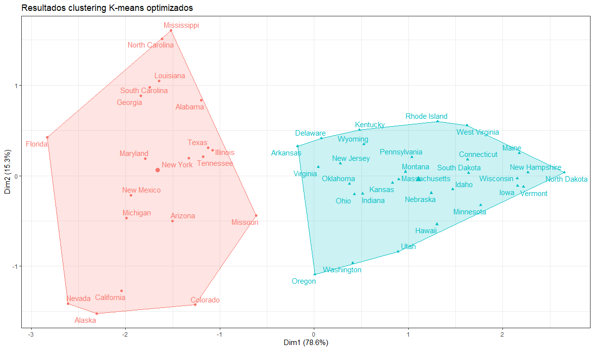

En este ejercicio trataremos de identificar Clusters dentro del dataset USArrests provisto por RStudio. Este dataset incluye estadísticas de asesinatos, violaciones, asaltos y población urbana de cada uno de los 50 estados de Estados unidos.

## Resumen del procedimiento

Identificaremos clusters dentro del dataset USArrests de RStudio. Luego, a los clúster obtenidos le aplicaremos un árbol de clasificación para determinar la importancia de todas las variables. En base a esto eliminaremos las variables que no nos interesan y volveremos a identificar los nuevos clusters.

## Atributos

* Murder: arrestos por asesinatos cada 100.000 habitantes.
* Assault: arrestos por asaltos cada 100.000 habitantes.
* UrbanPop: porcentaje de la población urbana.
* Rape:  arrestos por violaciones cada 100.000 habitantes.

A simple vista, la variable UrbanPop ya nos hace un poco de ruido, pero por el momento trabajaremos con todas las variables.

## Procedimiento

Primeramente seteamos nuestra carpeta de trabajo, instalamos las librerías necesarias y las iniciamos.

```
setwd("C:/Users/Fernando/Desktop/IA/portfolio/usarrest")

#Instalamos las librerias que hagan falta
install.packages("rattle")
install.packages("factoextra")

#Cargamos las librerías
library(rpart)
library(rattle)
library(factoextra)
```

Ahora procedemos a cargar la base de datos, y realizamos una mirada rápida a los datos

```
#Cargamos la base de datos
x = USArrests
head(x)
pairs(x)
```

Primeros 6 elementos del dataset:

```
> head(x)
               Murder   Assault   UrbanPop         Rape
Alabama    1.24256408 0.7828393 -0.5209066 -0.003416473
Alaska     0.50786248 1.1068225 -1.2117642  2.484202941
Arizona    0.07163341 1.4788032  0.9989801  1.042878388
Arkansas   0.23234938 0.2308680 -1.0735927 -0.184916602
California 0.27826823 1.2628144  1.7589234  2.067820292
Colorado   0.02571456 0.3988593  0.8608085  1.864967207
```



Como se aprecia, estos datos no están normalizados, procederemos a normalizar los mismos para poder trabajar con ellos.

```
#normalizamos
x = data.frame(scale(USArrests))
pairs(x)
```

Resultado luego de la normalización:



Ahora obtendremos el valor de **Hopkins**. Este es un indicador que determina la calidad de un conjunto de datos a la hora de crear clusters. Tiende a 1 cuando los datos son altamente clusterizables, y a 0,5 o menos cuando no es así.

```
#Obtenemos el valor de Hopkins
h = get_clust_tendency(x, 1e1, graph = FALSE)
h
```

Resultado de Hopkins obtenido:

```
> h
$hopkins_stat
[1] 0.549246

$plot
```

Este resultado de Hopkins indica que no será muy bueno el resultado obtenido al momento de clusterizar estos datos. Luego veremos si los podemos mejorar.

Ahora calcularemos la **silueta**, este indicador nos indica la cantidad optima de clusters para el conjunto de datos que estemos trabajando.

```
#silueta
silueta <- fviz_nbclust(x, kmeans, method = 'silhouette')
silueta
```

El resultado obtenido:



Como se aprecia en la imagen, la cantidad de clusters óptimas para identificar en este conjunto de datos es: 2. Ahora procederemos a identificar los clusters.

```
#Utilizamos la cantidad de clusters recomendados por la silueta: 2
q = kmeans(x, 2)
q

#Graficamos los clusters obtenidos
fviz_cluster(object = q, data = x, show.clust.cent = TRUE,
             star.plot = FALSE, repel = TRUE) +
  labs(title = "Resultados clustering K-means") +
  theme_bw() +
  theme(legend.position = "none")
```

Resultado de los clusters obtenidos:



En la imagen anterior se muestra los clusteres identificados por el momento. Ahora para ver si podemos mejorar un poco el indicador de Hopkins, agregaremos los clusters identificados a nuestro conjunto de datos y le aplicaremos un árbol de clasificación para que este nos determine la importancia de las variables. Tal vez podríamos eliminar alguna variable que no sea relevante.

```
#agregamos a los datos originales el cluster ID
x$cluster_id = q$cluster
head(x)
```

Ahora como se aprecia en la imagen siguiente, en nuestro conjunto de datos ya aparece la nueva variables que ingresamos arriba:

```
> head(x)
               Murder   Assault   UrbanPop         Rape cluster_id
Alabama    1.24256408 0.7828393 -0.5209066 -0.003416473          1
Alaska     0.50786248 1.1068225 -1.2117642  2.484202941          1
Arizona    0.07163341 1.4788032  0.9989801  1.042878388          1
Arkansas   0.23234938 0.2308680 -1.0735927 -0.184916602          2
California 0.27826823 1.2628144  1.7589234  2.067820292          1
Colorado   0.02571456 0.3988593  0.8608085  1.864967207          1
```

Ahora realizamos un árbol de clasificación:

```
#Realizamos un árbol de clasificación
t = rpart(cluster_id ~., data = x)

# Podamos el árbol
fancyRpartPlot(t)
```

El árbol obtenido:



Ahora que tenemos un árbol, podemos ver la importancia de las variables obteniendo este resultado:

```
> t$variable.importance
  Assault    Murder      Rape  UrbanPop 
10.237477  9.182999  6.590656  1.388430
```

Como se aprecia en la imagen superior, la variables UrbanPop no es relevante para el modelo. Ahora procederemos a crear un nuevo juego de datos únicamente con las variables: Murder, Assault, y Rape.

```
#Creamos una nueva base a partir de la original eliminando las variables UrbanPop y cluster_id
x1 = x[,-c(3,5)]
head(x1)
```

Resultado obtenido:

```
> head(x1)
               Murder   Assault         Rape
Alabama    1.24256408 0.7828393 -0.003416473
Alaska     0.50786248 1.1068225  2.484202941
Arizona    0.07163341 1.4788032  1.042878388
Arkansas   0.23234938 0.2308680 -0.184916602
California 0.27826823 1.2628144  2.067820292
Colorado   0.02571456 0.3988593  1.864967207
```

Ahora procederemos a calcular nuevamente la silueta que nos indicara la cantidad de clusters optimas para este nuevo conjunto de datos, los clusters y el indicador de Hopkins para ver si tuvo una mejora el eliminar el atributo UrbanPop.

```
#silueta
silueta2 <- fviz_nbclust(x1, kmeans, method = 'silhouette')
silueta2
```



La silueta a pesar de eliminar la variable UrbanPop nos sigue indicando que el conjunto de clusters óptimos es 2. Ahora procederemos a identificar los nuevos clusters y los graficaremos.

```
#k-means
q1 = kmeans(x1, centers = 2)

#Graficamos los clusters obtenidos
fviz_cluster(object = q1, data = x1, show.clust.cent = TRUE,
             star.plot = FALSE, repel = TRUE) +
  labs(title = "Resultados clustering K-means optimizados") +
  theme_bw() +
  theme(legend.position = "none")
```



Aquí tenemos los estados agrupados en dos clusters luego de eliminar la variable UrbanPop. Si bien se elimino una variable, estos permanecen agrupados tal como estaban al inicio. Pero ahora veremos el indicador de Hopkins.

```
#Obtenemos el valor de Hopkins
h1 = get_clust_tendency(x1, 1e1, graph = FALSE)
h1
```

Hopkins obtenido:

```
> h1
$hopkins_stat
[1] 0.7252427

$plot
NULL
```

## Conclusión

Obtuvimos un Hopkins de 0,72, bastante mejor que el inicial que era de solo 0,54. Estos clusters tienen mas valor que el identificado inicialmente.