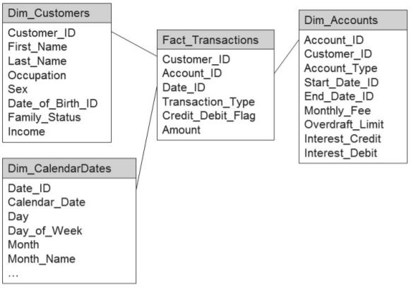
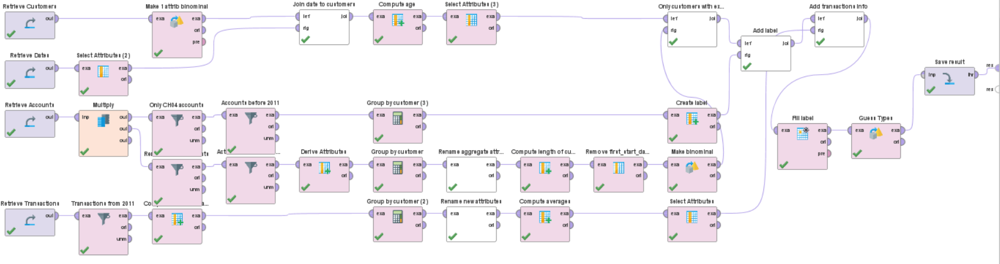

#### Este caso fue tomado del capitulo 7 del libro *“RapidMiner: Data Mining Use Cases and Business Analytics Applications”*, por Klinkenberg & Hofmann (2013).

Este caso de estudio trata sobre un banco el cual lanzo un nuevo producto (la cuenta **CH04**). Cómo cualquier producto nuevo, este fue adquirido por muy pocos clientes y la idea es promocionar este nuevo servicio no despilfarrando esfuerzos comunicándolo a todos sus clientes, sino hacer un estudio que permita identificar al 20% de los clientes mas afines a los que ya adquirieron este servicio para dirigirles a ellos el producto obteniendo un mayor ROI.

El esquema de los datos disponibles en el data warehouse del banco es de tipo estrella para este caso. Se encuentran las transacciones en el centro vinculada a las dimensiones de los clientes, cuentas y fechas.

## Preparación de los datos

Como ya se menciono, los datos se encuentra distribuidos en 4 tablas, por lo que es preciso unificar los mismos seleccionando o generando nuevas variables relevantes para el modelo, luego lo entrenaremos y evaluaremos los resultados.

La imagen siguiente muestra el proceso creado en RapidMiner para unificar todos los datos en un único dataset para realizar tareas de machine learning. Si bien esta tarea puede parecer demasiado compleja, RapidMiner la hace parecer bastante sencilla ya que cada uno de los operadores incluidos en la imagen se dedica a resolver algo particular, logrando en conjunto el resultado esperado.

Algunas de las tareas que se realizan como ejemplo son:

* Convertir el sexo a una variable binomial al igual que la variable payss_fee
* De las fechas unicamente se obtiene el identificador de la fecha y el año.
* Se trabajaran solo con transacciones anteriores a 2011.
* Se agrupan los resultados obtenidos por cliente.

A partir del proceso anterior se obtiene el siguiente dataset.

* is_buyer:
* sex:
* costumer_id:
* occupation:
* family_statuss:
* income:
* pays_fee:
* average_account_duration:
* customer_for_years:
* cash_withdrawl_sum:
* income_sume:
* insurance_sum:
* creditcard_sum:
* cash_withdrawl_avg:
* income_avg:
* insurance_avg:
* creditcard_avg:
* current_age:
* no_of_ch01_accounts:
* no_of_ch02_accounts:
* no_of_ch03_accounts:
* overdraft_total:
* no_of_accounts:

## Entrenamiento y evaluación