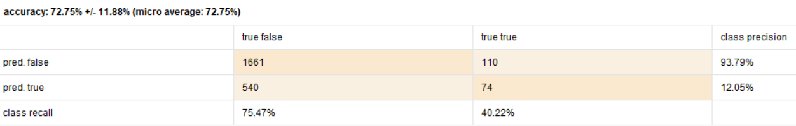

#### Este caso fue tomado del capitulo 7 del libro *“RapidMiner: Data Mining Use Cases and Business Analytics Applications”*, por Klinkenberg & Hofmann (2013).

Este caso de estudio trata sobre un banco el cual lanzo un nuevo producto (la cuenta **CH04**). Cómo cualquier producto nuevo, este fue adquirido por muy pocos clientes y la idea es promocionar este nuevo servicio no despilfarrando esfuerzos comunicándolo a todos sus clientes, sino hacer un estudio que permita identificar al 20% de los clientes mas afines a los que ya adquirieron este servicio para dirigirles a ellos el producto obteniendo un mayor ROI.

El esquema de los datos disponibles en el data warehouse del banco es de tipo estrella para este caso. Se encuentran las transacciones en el centro vinculada a las dimensiones de los clientes, cuentas y fechas.

## Preparación de los datos

Como ya se menciono, los datos se encuentra distribuidos en 4 tablas, por lo que es preciso unificar los mismos seleccionando o generando nuevas variables relevantes para el modelo, luego lo entrenaremos y evaluaremos los resultados.

La imagen siguiente muestra el proceso creado en RapidMiner para unificar todos los datos en un único dataset para realizar tareas de machine learning. Si bien esta tarea puede parecer demasiado compleja, RapidMiner la hace parecer bastante sencilla ya que cada uno de los operadores incluidos en la imagen se dedica a resolver algo particular, logrando en conjunto el resultado esperado.

Algunas de las tareas que se realizan como ejemplo son:

* Convertir el sexo a una variable binomial al igual que la variable payss_fee
* De las fechas unicamente se obtiene el identificador de la fecha y el año.
* Se trabajaran solo con transacciones anteriores a 2011.
* Se agrupan los resultados obtenidos por cliente.

A partir del proceso anterior se obtiene el siguiente dataset.

* is_buyer:
* sex:
* costumer_id:
* occupation:
* family_statuss:
* income:
* pays_fee:
* average_account_duration:
* customer_for_years:
* cash_withdrawl_sum:
* income_sume:
* insurance_sum:
* creditcard_sum:
* cash_withdrawl_avg:
* income_avg:
* insurance_avg:
* creditcard_avg:
* current_age:
* no_of_ch01_accounts:
* no_of_ch02_accounts:
* no_of_ch03_accounts:
* overdraft_total:
* no_of_accounts:

## Valores faltantes

En el proceso siguiente se trabaja en la depuración de valores faltantes y en la creación de nuevas categorías para ciertos atributos. A modo de ejemplo a los valores faltantes de *income* se los reemplaza por cero y a la *edad* de los clientes se los reemplaza por:

* kids
* teens
* young_adults
* adults
* seniors
* pensioners

además, a partir del importe *income* se generan nuevas categorías como ser: low, medium y high.

## Entrenamiento y evaluación

Al realizar un primer entrenamiento para el modelo a través de *cross validation* se obtiene el siguiente resultado:

Si miramos muy rápido podemos creer que tenemos muy buen resultado dado que el Accuracy es muy elevado. ¿Pero cual es el problema que estamos teniendo? El problema es que el algoritmo esta  sesgado al valor False, ya que aproximadamente el 93% de los 2300 registros no han adquirido la cuenta CH04 (se encuentra muy desbalanceado). ¿Que pasa con el class recall de True? es muy bajo.

Para solucionar esto se reemplaza el operador *Generate weight* (el cual le asigna un peso fijo a todos los ejemplos) por el operador *Balance classes*, el cual tiene como objetivo balancear las clases. Para esto le asignamos a true 1.0 y a false 0.1. Ahora si verificamos la performance, si bien el accuracy, sufrió una disminución del 20% aproximadamente, el class recall de true sufrió una importante mejora. Esto quiere decir que el modelo es mas preciso para predecir los valores verdaderos comparados con la versión anterior.

**Con árbol de decisión:**

**Con Random Forest:**

**Con Regresión Logística:**

## Conclusión

A la hora de evaluar la calidad del modelo no solo se debe mirar el accuracy que este tiene. Es importante analizar toda la matriz de confusión. 

Luego de probar el modelo con árboles de decisión, random forest y regresión logística, el que arrojo mejores resultados fue la regresión logística, con un accuracy de 71,53% y un class recall para True de 63,59%