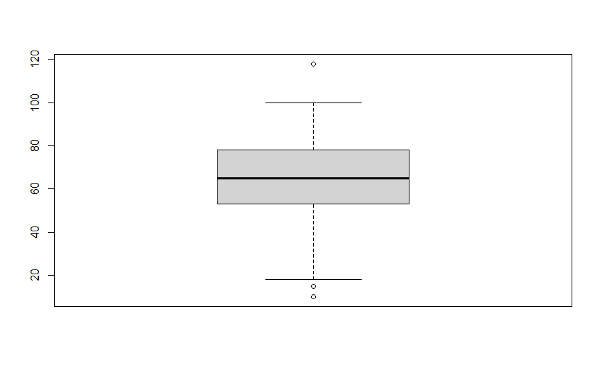
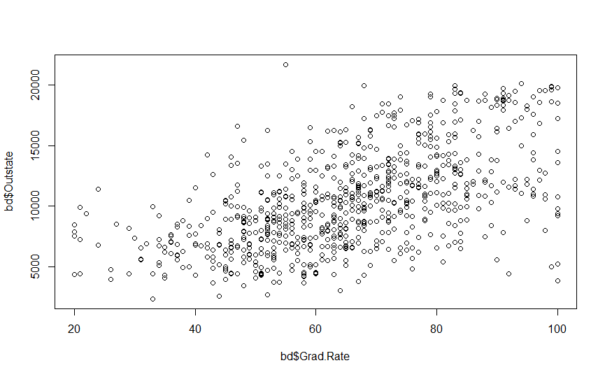
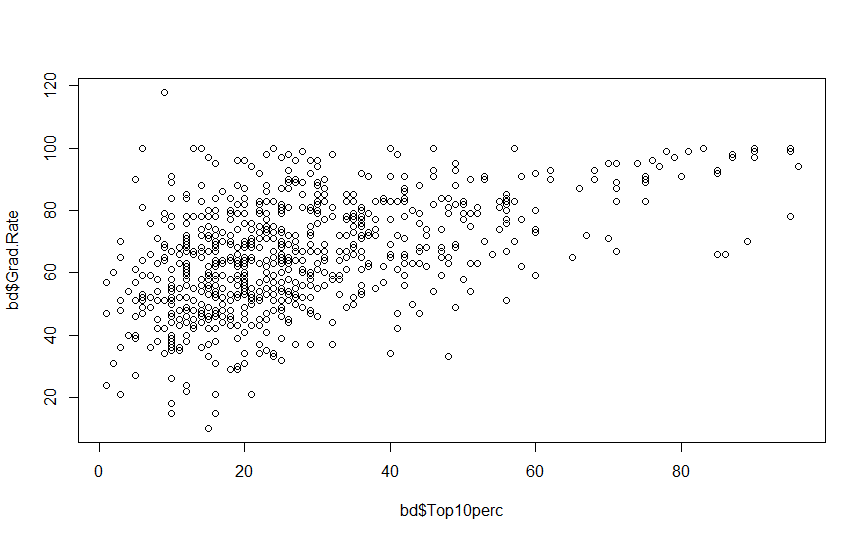
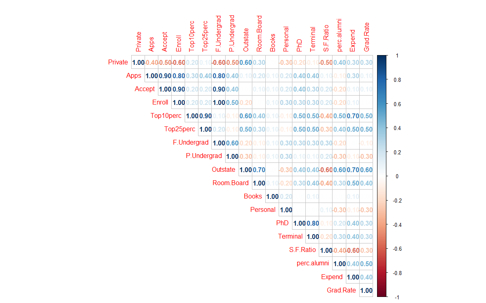
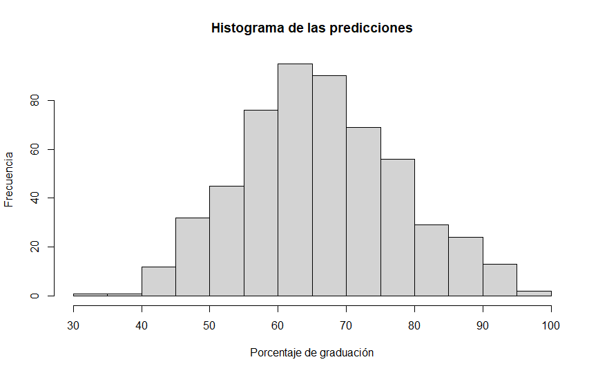

## Presentación del caso de estudio

Para este trabajo se hará uso de la base de datos College provista por el paquete ISLR de r, en la que se se buscara predecir la variable *Grad.Rate* en base a otros atributos que describen una universidad.

Arriba de este proyecto podrás descargar el código fuente (en r) que fue la base para este informe.

La base de datos College dispone de estadísticas de un gran número de universidades de Estados
Unidos correspondientes a la edición de 1995 de US News and World Report.

## Entendimiento de caso de uso y planificación del trabajo

Para responder esta pregunta se realizará un modelo supervisado en el que se hará una
regresión para predecir la variable *Grad.Rate*. Se utilizaran dos modelos distintos, una Regresión Lineal Simple y Random Forest. Para estos se analizara su comportamiento realizando comparativas entre ambos y concluiremos con las conclusiones de los casos.

## Extracción, transformación y carga de datos

Para la extracción y carga de los datos no tendremos mayores problemas ya que la base de datos se encuentra bien estructurada y sin valores nulos o vacíos. Lo único que deberemos hacer es dentro de RStudio importar la librería ISLR para tener acceso a la base de datos College.

## Exploración y análisis descriptivo

College es una base de datos que contiene 777 observaciones de las siguientes 18 variables:

* **Private**: factor con No, Yes indica si la universidad es pública o privada.
* **Apps**: número de solicitudes recibidas
* **Accept**: número de solicitudes aceptadas
* **Enroll**: número de nuevos estudiantes inscriptos
* **Top10pers**: porcentaje de nuevos alumnos que integraban el 10% superior en su liceo
* **Top25pers**: porcentaje de nuevos alumnos que integraban el 25% superior en su liceo
* **F.Undergrad**: número de estudiantes universitarios a tiempo completo
* **P.Undergrad**: número de estudiantes universitarios a medio tiempo
* **Outstate**: gasto de tutoría por ser estudiante de fuera del estado o extranjero
* **Room.Board**: costo de alojamiento y comida
* **Books**: costo estimado de libros
* **Personal**: gastos personales estimados
* **PhD**: porcentaje de la facultad con Doctorados
* **Terminal**: porcentaje de facultad con título terminal
* **S.F.Ratio**: relación estudiante/facultad
* **pers.alumni**: porcentaje de ex alumnos que donan
* **Expend**: gastos de instrucción por alumno
* **Grad.Rate**: tasa de graduación (variable objetivo)

Aplicando *str()* a nuestro conjunto de datos se obtiene la estructura de nuestros dato, la cual se
expone a continuación:

```
> str(bd)
'data.frame':	777 obs. of  18 variables:
 $ Private    : Factor w/ 2 levels "No","Yes": 2 2 2 2 2 2 2 2 2 2 ...
 $ Apps       : num  1660 2186 1428 417 193 ...
 $ Accept     : num  1232 1924 1097 349 146 ...
 $ Enroll     : num  721 512 336 137 55 158 103 489 227 172 ...
 $ Top10perc  : num  23 16 22 60 16 38 17 37 30 21 ...
 $ Top25perc  : num  52 29 50 89 44 62 45 68 63 44 ...
 $ F.Undergrad: num  2885 2683 1036 510 249 ...
 $ P.Undergrad: num  537 1227 99 63 869 ...
 $ Outstate   : num  7440 12280 11250 12960 7560 ...
 $ Room.Board : num  3300 6450 3750 5450 4120 ...
 $ Books      : num  450 750 400 450 800 500 500 450 300 660 ...
 $ Personal   : num  2200 1500 1165 875 1500 ...
 $ PhD        : num  70 29 53 92 76 67 90 89 79 40 ...
 $ Terminal   : num  78 30 66 97 72 73 93 100 84 41 ...
 $ S.F.Ratio  : num  18.1 12.2 12.9 7.7 11.9 9.4 11.5 13.7 11.3 11.5 ...
 $ perc.alumni: num  12 16 30 37 2 11 26 37 23 15 ...
 $ Expend     : num  7041 10527 8735 19016 10922 ...
 $ Grad.Rate  : num  60 56 54 59 15 55 63 73 80 52 ...
```

A continuación, se muestra un boxplot de *Grad.Rate*, la variable que se intentara predecir:



Se aprecian muy poquitos outliers, pero estos son considerados como insignificantes ya que la eliminación de los mismos no alteraría el resultado final de los modelos planteados en el presente informe.

A continuación, se muestra un ploteo entre la variable Grad.Rate y Ouststate en la que se ve su relación, siendo esta ultima una de las variables mas importantes como se verá más adelante.



El siguiente cuadro me pareció importante incorporarlo ya que demuestra que no importa que se haya tenido las mejores notas en el liceo, esto no implicara que en la universidad se obtengan muy buenos resultados.



### Matriz de correlación

La siguiente matriz de correlación se le aplico a toda la base College, esto nos mostrara la relación entre las diferentes variables de este modelo.



Esta matriz nos da un indicio de que hay variables con una fuerte correlación positiva entre sí, a modo de ejemplo la variable Enroll con las variables Apps y Accept, es posible entonces que algunas de estas variables muy asociadas entre sí no sean significativas para el modelo, tal cual ser verá más adelante en el trabajo con el modelo de Regresión Lineal.

## Modelado y Evaluación

Para esta predicción utilizaremos dos métodos, Regresión Lineal Simple y Random Forest. Optimizaremos y compararemos el comportamiento de estos dos métodos a fin de poder concluir cual es el que mejor se adapta a nuestras necesidades.

### Regresión Lineal Simple

Para esta técnica, primeramente, se ejecutó el método con todas las variables, obteniendo los
siguientes resultados (pequeña extracción de summary):

```
Coefficients:
              Estimate Std. Error t value Pr(>|t|)    
(Intercept) 30.9028063  5.6392939   5.480 6.60e-08 ***
PrivateYes   5.1386014  2.0122856   2.554  0.01094 *  
Apps         0.0016161  0.0005187   3.116  0.00193 ** 
Accept      -0.0010415  0.0009395  -1.109  0.26815    
Enroll       0.0036580  0.0026286   1.392  0.16463    
Top10perc    0.0346841  0.0834505   0.416  0.67785    
Top25perc    0.1439920  0.0628210   2.292  0.02229 *  
F.Undergrad -0.0007524  0.0004572  -1.646  0.10041    
P.Undergrad -0.0011875  0.0004241  -2.800  0.00529 ** 
Outstate     0.0010547  0.0002599   4.058 5.70e-05 ***
Room.Board   0.0014166  0.0006724   2.107  0.03562 *  
Books        0.0001457  0.0030228   0.048  0.96157    
Personal    -0.0023993  0.0008519  -2.816  0.00504 ** 
PhD          0.1236968  0.0634113   1.951  0.05162 .  
Terminal    -0.0843641  0.0693802  -1.216  0.22454    
S.F.Ratio    0.2291859  0.1885424   1.216  0.22469    
perc.alumni  0.2193759  0.0547650   4.006 7.07e-05 ***
Expend      -0.0004226  0.0001970  -2.145  0.03240 *  
---
Signif. codes:  0 ‘***’ 0.001 ‘**’ 0.01 ‘*’ 0.05 ‘.’ 0.1 ‘ ’ 1
```

La columna t value muestra la prueba t asociada con la prueba de significancia del parámetro que figura en la primer columna, Pr (>│t│) proporciona el p valor de esa prueba t. Entendiendo que la hipótesis nula en nuestro modelo es que la variable de la primer columna no es significativa para explicar el Grad.Rate, por lo general se considera que un valor p de 0.05 o menos rechaza dicha hipótesis, considerando entonces a ese parámetro como significativo. Las restantes variables podrían por lo tanto ser desechadas.

Debido a que trabajar con todas las variables del modelo podría agotar mucho tiempo y recursos en la obtención de los mismos y no nos aportarían gran relevancia, como se apreció en el apartado de análisis descriptivo de los datos, la matriz de correlación nos indicó que en nuestra base de análisis hay variables con una alta colinealidad o correlación. Por lo expuesto procederemos a utilizar *step* para que nos indique cuales serán las variables recomendadas para trabajar. El resultado debería ser similar al que arroja el estudio de p valor visto anteriormente.

Para identificar la colinealidad entre las variables usaremos factores de inflación de varianza (VIF). En este análisis cuanto mayor es el valor del VIF, mayor es la colinealidad. Calculamos entonces el VIF para cada variable y vamos eliminando aquellas con valores altos. La definición de 'alto' que tomaremos para este ejercicio es un VIF > 5.

La eliminación de variables individuales de forma simultanea con valores altos de VIF en la comparación inicial no es lo ideal, ya que los valores de VIF cambiarán después de eliminar cada variable. Por lo expuesto, realizaremos un enfoque gradual, eliminando la variable con VIF más alto y ejecutando nuevamente, repitiendo el proceso hasta que todos los valores VIF estén por debajo del umbral deseado (menor a 5 en nuestro caso). El resultado final de este proceso se expone a continuación:

```
> vif(modelosimple5)
    Private        Apps   Top25perc P.Undergrad    Outstate  Room.Board    Personal         PhD perc.alumni      Expend 
   2.791996    2.082394    2.050054    1.496521    3.947868    1.878437    1.239493    1.947419    1.732255    2.380616 
```

La siguiente tabla muestra un resumen de nuestro modelo final para explicar Grad.Rate, el cual se redujo a un total de 10 variables:

```
> summary(modelosimple5)

Call:
lm(formula = Grad.Rate ~ Private + Apps + Top25perc + P.Undergrad + 
    Outstate + Room.Board + Personal + PhD + perc.alumni + Expend, 
    data = collegeTrain)

Residuals:
    Min      1Q  Median      3Q     Max 
-43.034  -7.203  -0.411   6.423  53.119 

Coefficients:
              Estimate Std. Error t value Pr(>|t|)    
(Intercept) 32.4366243  3.4524075   9.395  < 2e-16 ***
PrivateYes   5.5564280  1.9264538   2.884 0.004081 ** 
Apps         0.0010348  0.0002021   5.120 4.28e-07 ***
Top25perc    0.1661595  0.0369100   4.502 8.28e-06 ***
P.Undergrad -0.0014028  0.0003960  -3.542 0.000432 ***
Outstate     0.0009620  0.0002519   3.819 0.000150 ***
Room.Board   0.0013690  0.0006544   2.092 0.036922 *  
Personal    -0.0027008  0.0008228  -3.282 0.001096 ** 
PhD          0.0623316  0.0427785   1.457 0.145683    
perc.alumni  0.2247804  0.0538921   4.171 3.54e-05 ***
Expend      -0.0003978  0.0001595  -2.493 0.012959 *  
---
Signif. codes:  0 ‘***’ 0.001 ‘**’ 0.01 ‘*’ 0.05 ‘.’ 0.1 ‘ ’ 1
```

Como se puede apreciar, el resultado que arroja es similar al estudio de p valor realizado inicialmente, manteniendo la mayoría de las variables un p valor menor a 0.05 y las 2 que no lo hacen (PRivateYes y PhD) ya habían sido detectadas y arrojado un resultado similar en nuestro primer recuadro de coeficientes.

Una vez obtenido el modelo idóneo, se utilizó la función *predict* sobre el mismo. A continuación se aprecia un histograma del modelo final:



Para medir la precisión del modelo de Regresión Lineal Simple se hizo un *postResample* del modelo con la graduación original del conjunto de entrenamiento, arrojando el siguiente resultado:

```
> postResample(regresionLineal,graduacionOriginal)
      RMSE   Rsquared        MAE 
11.8745199  0.4874459  9.0114746 
```

Finalmente, con este modelo se aplicó la predicción a nuestro juego de datos de test (collegeTest) obteniendo lo siguiente:

```
> postResample(pred = regresionLineal2, obs = graduacionOriginalTest)
      RMSE   Rsquared        MAE 
14.4538787  0.3833957 10.7741790 
```

Como se puede apreciar, el resultado de la predicción del conjunto de test es prácticamente el mismo que le predicción realizada a nuestro conjunto de entrenamiento. Se puede entonces considerar que, para conjuntos desconocidos, el modelo predecirá correctamente.

### Random Forest

Para esta técnica en un principio se considero usar el mismo conjunto de variables acotados con el cual se quedo nuestro modelo final de Regresión Simple, pero sabiendo cómo funciona Random Forest decidimos que esto no era necesario.

Antes de ejecutar el Random Forest, se buscó la optimización del mismo buscando los valores apropiados tanto para el ntree como para el mtry.

Luego de esta optimización y para los valores de seed elegidos se llegó a la conclusión de que los valores óptimos para su ejecución son 700 para ntree y 4 para el mtry. Se utilizó como criterio para la selección el menor valor de RMSE.

A continuación se expone el postResample de nuestro conjunto de entrenamiento:

```
> postResample(randForestFinal,graduacionOriginal)
     RMSE  Rsquared       MAE 
5.1595314 0.9343246 3.7850920 
```

Aplicado este modelo al conjunto de test:

```
> postResample(pred = randForest2, obs = graduacionOriginalTest)
      RMSE   Rsquared        MAE 
14.3802518  0.3942109 10.7726276 
```

## Conclusiones

1. Si bien el modelo de Random Forest predice mejor para el conjunto de entrenamiento, arroja resultados similares al modelo de Regresión Lineal para los conjuntos de test.
2. Los buenos resultados obtenidos con el método de Regresión Lineal pueden ser
   explicados por un comportamiento bastante lineal de la propia base College.
3. Luego de comparar resultados, se considera que para la predicción de *Grade.Rate* es mejor utilizar el método de Regresión Lineal Simple ya que es más sencilla su interpretación, no exige grandes cálculos computacionales y sobre todo arroja resultados similares en el conjunto de test comparados con Random Forest.
4. Según el método de Regresión Lineal Simple para explicar el Grad.Rate las variables más importantes son: Apps, Top25perc, Outstate, P.Undergrad, perc.alumni.
5. Sorprendentemente el gasto en Books no es significativo lo que se podría explicar a través de la facilidad de acceso a internet.

Las técnicas aplicadas fueron ejecutadas con varias seeds distintas, obteniendo en todas las ejecuciones comportamientos similares entre ambos métodos.

### Posibles ampliaciones

Como posibles ampliaciones o mejoras a este trabajo se le podría agregar *cross validation* a la Regresion Lineal Simple siendo  esta técnica utilizada para la evaluación de resultados la cual garantiza la independencia entre el subconjunto de datos de entrenamiento y test.