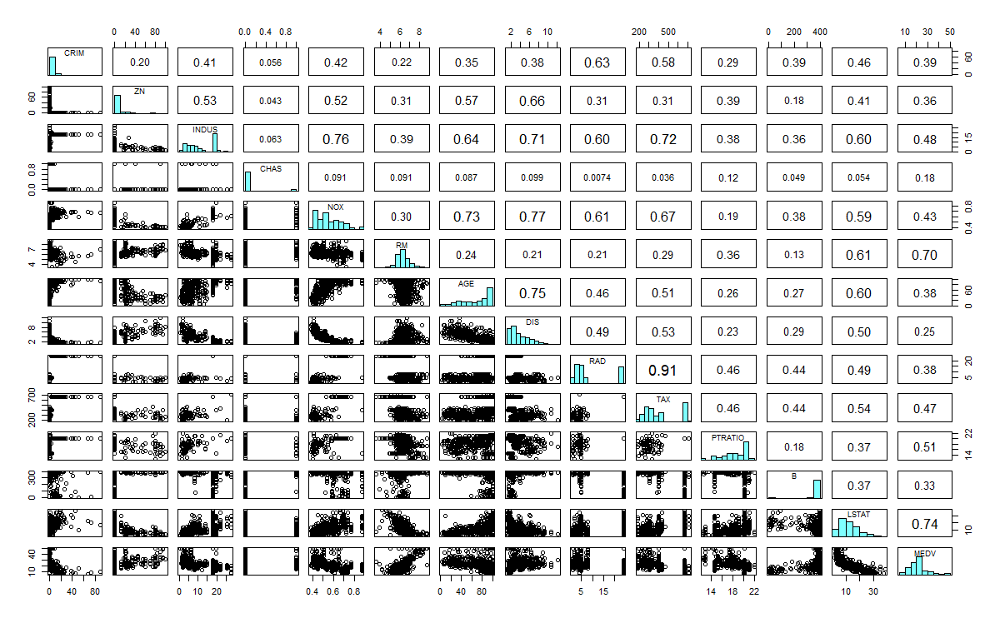
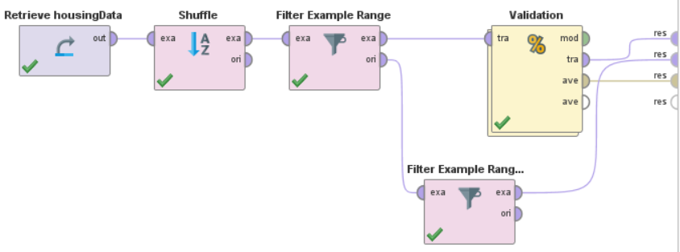
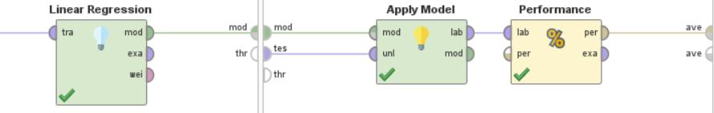
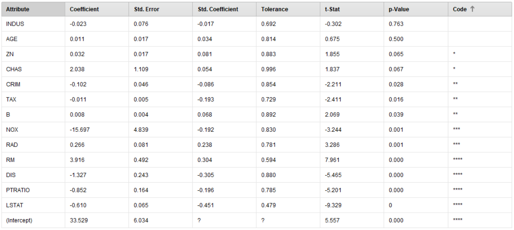
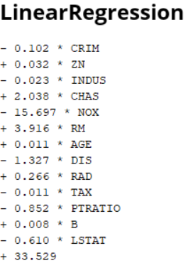
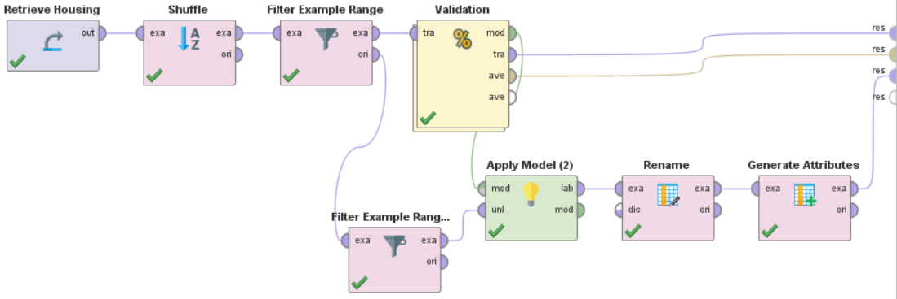
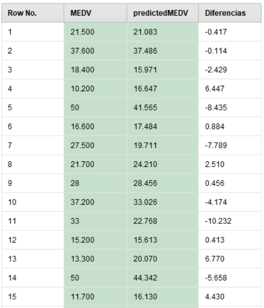

Para realizar este proyecto haremos uso del dataset de Housing ubicado en el repositorio de UCI: <https://archive.ics.uci.edu/ml/machine-learning-databases/housing/>

También en la parte superior de esta entrada lo podrás descargar mas fácilmente.

**En este trabajo tendremos como objetivos:**

* Identificar cuáles atributos, entre los varios disponibles, son necesarios para predecir con exactitud la mediana de precios de una casa.
* Construir un modelo de regresión lineal múltiple para predecir la mediana de los precios utilizando los atributos más importantes.
* Evaluar la exactitud del modelo para predecir nuevos ejemplos

Este dataset cuenta con 506 registros (ninguno es faltante) y 14 atributos referentes a características con las que cuentan en la ciudad de Boston (EEUU).

## Atributos

* CRIM: tasa de delincuencia per cápita en la ciudad.
* ZN: proporción de terreno residencial dividido en zonas para lotes de más de 25,000 pies cuadrados.
* INDUS: proporción de acres comerciales no minoristas por ciudad.
* CHAS: variable ficticia de Charles River (1 si el tramo limita con el río; 0 en caso contrario)
* NOX: concentración de óxidos nítricos (partes por 10 millones).
* RM: número medio de habitaciones por vivienda
* AGE: proporción de unidades ocupadas por el propietario construidas antes de 1940
* DIS: distancias ponderadas a cinco centros de empleo de Boston.
* RAD: índice de accesibilidad a carreteras radiales
* TAX: tasa de impuesto a la propiedad de valor total por $ 10,000
* PTRATIO: Proporción alumno-profesor por ciudad
* B: 1000 (Bk - 0.63) ^ 2 donde Bk es la proporción de afrodescendientes por ciudad
* LSTAT: % menor estado de la población
* MEDV: valor medio de las viviendas ocupadas por el propietario en $ 1000

## Relación entre variables

Para tener un acercamiento a la relación entre las variables se adjunta una tabla obtenida de los datos a través de RStudio. Este grafico nos puede dar una rápida visión de las variables que se puedan encontrar correlacionadas. En esta entrada, te muestro los pasos a realizar para obtener este grafico: Enlace

## Proceso

Para este trabajo, utlizando RapidMiner, primera importaremos nuestros datos y luego le aplicaremos el operador *shuffle*. Esto nos servirá ya que randomizara el orden de los datos para que cuando hagamos las particiones en un conjunto de entrenamiento y otro de test, las particiones sean estadísticamente similares. Luego aplicaremos 2 operadores *filter example range*, el primero para particionar los elementos desde el 1 al 450 y el otro para hacerlo de 451 al 506. Finalmente le agregaremos el proceso *Split Validation* con los parámetros por defecto. En este momento el proceso debería estar como el de la imagen Parte 1.

Dentro del proceso *Split Validation*, agregamos los operadores que se encuentran en la siguiente imagen:

Aquí en el operador *Performance*, selecciona los parámetros: squared error, correlation y squared correlation.

Si antes de ejecutor el proceso, le agregamos un punto de interrupción al operador Linear Regression (clic derecho encima, Breakpoint After), el programa nos mostrara las variables que el modelo considera importante para estos datos. Sería conveniente trabajar solamente con las que tengan 4 estrellas ya que a estas RapidMiner las considera altamente significativas.

En la siguiente imagen se pueden obtener los coeficientes de los atributos lo que permite obtener la predicción para un elemento x.

Hasta ahora, hemos trabajado solamente con el conjunto de entrenamiento, ya es hora de que le apliquemos el modelo creado a nuestro conjunto de test (los registros que teníamos guardados por el momento del 451 al 506). Para esto agregaremos un operador *Apply Model* para aplicar nuestro modelo al conjunto de test, luego en el operador *Rename* renombraremos la variable MEDV (Prediction) a predictedMEDV para poder operar con ella en el operador *Generate Attributes* creando una variable Diferencias (predictedMEDV - MEDV). El modelo final queda como la imagen Parte2

A modo de exposición, se muestra los primeros 15 resultados obtenidos del conjunto de test.

