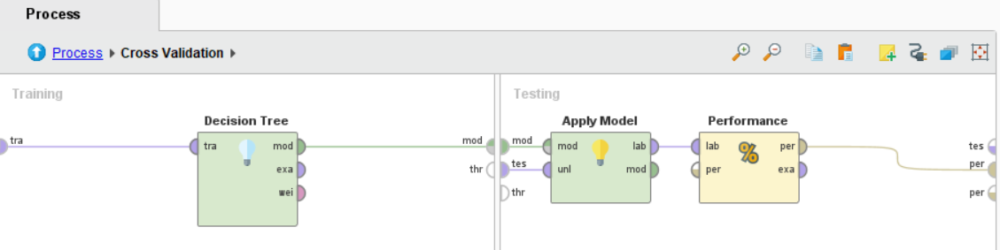

A continuación se predecirá el grado de supervivencia del Titanic (específicamente la variable Survived) a traves de las diferentes variables que componen el dataset Titanic. Para los efectos prácticos se tomara la base *Titanic* que viene dentro los ejemplos de RapidMiner.

El dataset cuenta con 12 atributos y 1.309 registros.

## Atributos

* Passenger Class: la clase en la que viajo la persona, puede ser *First*, *Second* o *Third*
* Name: nombre del pasajero
* Sex: sexo del pasajero, puede ser *Female* o *Male*
* Age: edad del pasajero (hay 263 valores faltantes)
* No of Siblings or Spouses on Board: 
* No of Parents or Children on Board:
* Ticket Number: numero del ticket.
* Passenger Fare: costo del ticket del pasajero (1 valor faltante)
* Cabin: numero de la cabina o camarote del pasajero (1.014 valores faltantes)
* Port of Embarkation: puerto de embarcación (2 variables faltantes)
* Life Boat: numero del bote salvavidas (823 variables faltantes)
* Survived: indica si el pasajero sobrevivió o no, puede ser *Yes* o *No*

## Relaciones entre variables


La imagen anterior muestra una alta correlación indicando que la gran mayoría de los pasajeros que tenían un bote salvavidas tenían muchísimas probabilidades de sobrevivir, por lo que esta variable no será tenida en cuenta para este estudio.

Para este estudio tampoco se tendrán en cuenta el *Ticket Number* y *Name* (nombre de los pasajeros) ya que estos son únicamente identificadores. 


El grafico anterior nos muestra que las mujeres (principalmente las que tickets mas caros) sobrevivieron mas que los hombres.

## Atributos faltantes

Con respecto a la variable *Cabin*, como el 77% de los atributos es faltante, lo correcto es no tener en cuenta esta variable para el estudio ya que intentar obtener un valor para estos nos puede llevar a un resultado erróneo.

La variable Age, solamente con 263 atributos faltantes, para estos se les generara el promedio de todas las edades que se incluyan en el dataset.

Con respecto a la variable Passenger Fare, en la cual había un observación de la cual no se contaban con registros se omitirá toda esa fila.

A continuación se muestra el proceso llevado a cabo hasta el momento en RapidMiner


Como se observa en la siguiente imagen, prácticamente no hay atributos que estén altamente correlacionados.


Al agregar el operador *Decision Tree*, RapidMiner ya nos indica cuales son las variables mas importantes creándonos un árbol de decisión. Gracias a esto, sabemos que *Sex* es la variable mas importante.

```
Sex = Female
|   No of Siblings or Spouses on Board > 4.500: No {Yes=0, No=6}
|   No of Siblings or Spouses on Board ≤ 4.500
|   |   No of Parents or Children on Board > 5.500: No {Yes=0, No=2}
|   |   No of Parents or Children on Board ≤ 5.500
|   |   |   Passenger Class = Third > 0.500
|   |   |   |   Passenger Fare > 32.881: No {Yes=0, No=5}
|   |   |   |   Passenger Fare ≤ 32.881
|   |   |   |   |   Age > 0.875
|   |   |   |   |   |   Passenger Fare > 31.331: Yes {Yes=2, No=0}
|   |   |   |   |   |   Passenger Fare ≤ 31.331
|   |   |   |   |   |   |   Passenger Fare > 24.808: No {Yes=0, No=13}
|   |   |   |   |   |   |   Passenger Fare ≤ 24.808: Yes {Yes=101, No=84}
|   |   |   |   |   Age ≤ 0.875: Yes {Yes=3, No=0}
|   |   |   Passenger Class = Third ≤ 0.500
|   |   |   |   Passenger Fare > 26.125: Yes {Yes=166, No=5}
|   |   |   |   Passenger Fare ≤ 26.125
|   |   |   |   |   Age > 56: No {Yes=0, No=2}
|   |   |   |   |   Age ≤ 56: Yes {Yes=67, No=10}
Sex = Male
|   Passenger Fare > 387.665: Yes {Yes=2, No=0}
|   Passenger Fare ≤ 387.665
|   |   No of Siblings or Spouses on Board > 4.500: No {Yes=0, No=9}
|   |   No of Siblings or Spouses on Board ≤ 4.500
|   |   |   No of Parents or Children on Board > 2.500: No {Yes=0, No=8}
|   |   |   No of Parents or Children on Board ≤ 2.500
|   |   |   |   Passenger Fare > 254.948: Yes {Yes=1, No=1}
|   |   |   |   Passenger Fare ≤ 254.948
|   |   |   |   |   Passenger Fare > 152.506: No {Yes=0, No=10}
|   |   |   |   |   Passenger Fare ≤ 152.506
|   |   |   |   |   |   Passenger Fare > 116.638
|   |   |   |   |   |   |   Passenger Fare > 135.067
|   |   |   |   |   |   |   |   Port of Embarkation = Southampton > 0.500: Yes {Yes=1, No=1}
|   |   |   |   |   |   |   |   Port of Embarkation = Southampton ≤ 0.500: No {Yes=0, No=3}
|   |   |   |   |   |   |   Passenger Fare ≤ 135.067: Yes {Yes=5, No=0}
|   |   |   |   |   |   Passenger Fare ≤ 116.638
|   |   |   |   |   |   |   Passenger Fare > 26.269
|   |   |   |   |   |   |   |   Passenger Fare > 26.469: No {Yes=58, No=126}
|   |   |   |   |   |   |   |   Passenger Fare ≤ 26.469: Yes {Yes=4, No=0}
|   |   |   |   |   |   |   Passenger Fare ≤ 26.269
|   |   |   |   |   |   |   |   Age > 10: No {Yes=74, No=518}
|   |   |   |   |   |   |   |   Age ≤ 10: Yes {Yes=16, No=5}
```

## Resultados

Finalmente, aplicaremos el operador *Cross Validation* para poder medir la performance del modelo con un *Decision Tree*.



Proceso final:


A continuación se expone el resultado de la performance obtenida para el modelo realizado:

